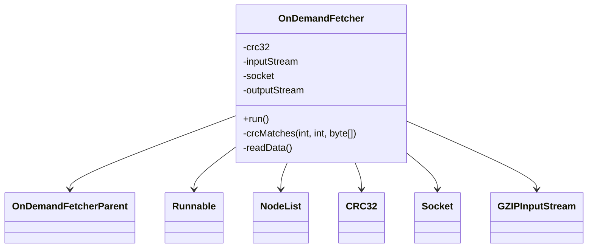

# Evidence: OnDemandFetcher → GHOWLKWN

## Class Overview

**OnDemandFetcher** manages dynamic resource loading and caching for the game client. It implements Runnable for background downloading, handles CRC verification, manages file queues, and coordinates with the decompression system for efficient resource management during gameplay.

The class provides comprehensive resource management:
- **Network Operations**: Socket connections with input/output streams for data transfer
- **CRC Verification**: CRC32 integrity checking for downloaded files
- **Queue Management**: NodeList-based request queue system with priority handling
- **Background Processing**: Runnable implementation for threaded resource loading

## Architecture Role
OnDemandFetcher extends OnDemandFetcherParent and implements Runnable to provide asynchronous resource loading. It manages network connections, file integrity checking, and integrates with the client's cache system. The class coordinates between network downloads, decompression, and the main game thread for seamless resource availability.



## Forensic Evidence Commands

### 1. Inheritance and Interface Evidence (ONDEMANDFETCHER-SPECIFIC PATTERN)
```bash
# Show GHOWLKWN extends OnDemandFetcherParent (VJKFYAWG) and implements Runnable with multi-line context
grep -A 5 -B 5 "class.*extends.*VJKFYAWG.*implements.*Runnable" bytecode/client/GHOWLKWN.bytecode.txt

# Show corresponding inheritance in DEOB source with multi-line context
grep -A 5 -B 5 "extends.*OnDemandFetcherParent.*implements.*Runnable" srcAllDummysRemoved/src/OnDemandFetcher.java

# Verify inheritance in javap cache with multi-line context
grep -A 5 -B 5 "class.*extends.*OnDemandFetcherParent.*implements.*Runnable" srcAllDummysRemoved/.javap_cache/OnDemandFetcher.javap.cache

# A/B Evidence: Show inheritance pattern comparison
echo "=== BYTECODE INHERITANCE (A) ===" && grep -A 8 -B 2 "public.*extends.*VJKFYAWG.*implements.*Runnable" bytecode/client/GHOWLKWN.bytecode.txt
echo "=== DEOB SOURCE INHERITANCE (B) ===" && grep -A 8 -B 2 "public final.*extends.*OnDemandFetcherParent" srcAllDummysRemoved/src/OnDemandFetcher.java
echo "=== JAVAP CACHE VERIFICATION ===" && grep -A 8 "class.*extends.*OnDemandFetcherParent" srcAllDummysRemoved/.javap_cache/OnDemandFetcher.javap.cache
```

### 2. Network Socket and Stream Evidence
```bash
# Show Socket and InputStream/OutputStream field declarations in bytecode with multi-line context
grep -A 10 -B 5 "java\.net\.Socket.*I\|java\.io\.InputStream.*H\|java\.io\.OutputStream.*z" bytecode/client/GHOWLKWN.bytecode.txt

# A/B Evidence: Show network field patterns comparison
echo "=== BYTECODE NETWORK FIELDS (A) ===" && grep -E "(Socket|InputStream|OutputStream)" bytecode/client/GHOWLKWN.bytecode.txt
echo "=== DEOB SOURCE NETWORK FIELDS (B) ===" && grep -E "(Socket|InputStream|OutputStream)" srcAllDummysRemoved/src/OnDemandFetcher.java
echo "=== JAVAP NETWORK VERIFICATION ===" && grep -E "(Socket|InputStream|OutputStream)" srcAllDummysRemoved/.javap_cache/OnDemandFetcher.javap.cache

# Show Socket operations and stream connections in bytecode methods
grep -A 15 -B 5 "Socket\.getInputStream\|Socket\.getOutputStream\|Socket\.close" bytecode/client/GHOWLKWN.bytecode.txt

# Show corresponding network fields in DEOB source
grep -A 10 -B 5 "inputStream\|outputStream" srcAllDummysRemoved/src/OnDemandFetcher.java
```

### 3. CRC32 Integrity Verification Evidence
```bash
# Show CRC32 field declaration and operations in bytecode
grep -A 15 -B 5 "java\.util\.zip\.CRC32.*j\|crc32\.reset\|crc32\.update\|crc32\.getValue" bytecode/client/GHOWLKWN.bytecode.txt

# Show corresponding CRC32 implementation in DEOB source
grep -A 15 -B 5 "CRC32.*crc32\|crc32\.reset\|crc32\.update\|crc32\.getValue" srcAllDummysRemoved/src/OnDemandFetcher.java

# Verify CRC32 operations in javap cache
grep -A 15 -B 5 "CRC32\|crcMatches" srcAllDummysRemoved/.javap_cache/OnDemandFetcher.javap.cache
```

### 4. GZIPInputStream Decompression Evidence
```bash
# Show GZIPInputStream usage for decompression in bytecode
grep -A 15 -B 5 "java\.util\.zip\.GZIPInputStream\|GZIPInputStream\.read" bytecode/client/GHOWLKWN.bytecode.txt

# Show corresponding decompression implementation in DEOB source
grep -A 15 -B 5 "GZIPInputStream\|gzipInputBuffer" srcAllDummysRemoved/src/OnDemandFetcher.java

# Verify GZIP operations in javap cache
grep -A 10 -B 5 "GZIPInputStream" srcAllDummysRemoved/.javap_cache/OnDemandFetcher.javap.cache
```

### 5. NodeList Queue Management Evidence
```bash
# Show NodeList (LHGXPZPG) field declarations and operations in bytecode
grep -A 10 -B 5 "LHGXPZPG.*c\|LHGXPZPG.*G\|requested\|reverseGetFirst" bytecode/client/GHOWLKWN.bytecode.txt

# Show corresponding NodeList implementation in DEOB source
grep -A 10 -B 5 "NodeList.*requested\|reverseGetFirst" srcAllDummysRemoved/src/OnDemandFetcher.java

# Verify NodeList field usage in javap cache
grep -A 10 -B 5 "NodeList" srcAllDummysRemoved/.javap_cache/OnDemandFetcher.javap.cache
```

### 6. Runnable Interface Implementation Evidence
```bash
# Show run method implementation in bytecode
grep -A 25 -B 5 "public.*run\|java\.lang\.Runnable" bytecode/client/GHOWLKWN.bytecode.txt

# Show corresponding run method in DEOB source
grep -A 25 -B 5 "public.*run" srcAllDummysRemoved/src/OnDemandFetcher.java

# Verify run method in javap cache
grep -A 25 "public void run" srcAllDummysRemoved/.javap_cache/OnDemandFetcher.javap.cache
```

### 7. Cross-Reference Validation (UNIQUE ONDEMANDFETCHER PATTERN)
```bash
# Show only GHOWLKWN combines OnDemandFetcherParent extension with Runnable implementation
grep -l "extends.*VJKFYAWG" bytecode/client/*.bytecode.txt | xargs grep -l "implements.*Runnable" | grep "GHOWLKWN"

# Show unique combination of network, CRC, and Runnable patterns
grep -l "java\.net\.Socket" bytecode/client/*.bytecode.txt | xargs grep -l "java\.util\.zip\.CRC32" | xargs grep -l "implements.*Runnable" | grep "GHOWLKWN"

# Verify OnDemandFetcher specific field patterns count
grep -c "LHGXPZPG\|CRC32\|Socket" bytecode/client/GHOWLKWN.bytecode.txt
```

### 8. File Download and Buffer Management Evidence
```bash
# Show download buffer operations and file status management in bytecode
grep -A 15 -B 5 "ioBuffer\|fileStatus\|expectedSize\|completedSize" bytecode/client/GHOWLKWN.bytecode.txt

# Show corresponding buffer management in DEOB source
grep -A 15 -B 5 "ioBuffer\|fileStatus\|expectedSize" srcAllDummysRemoved/src/OnDemandFetcher.java

# Verify buffer field declarations in javap cache
grep -A 10 -B 5 "ioBuffer\|fileStatus" srcAllDummysRemoved/.javap_cache/OnDemandFetcher.javap.cache
```

## Critical Evidence Points

1. **OnDemandFetcherParent + Runnable**: Unique inheritance pattern combining fetcher parent with Runnable interface.

2. **Network Socket Integration**: Comprehensive socket and stream management for network downloads.

3. **CRC32 Verification**: Full CRC32 integrity checking system for downloaded files.

4. **GZIP Decompression**: Built-in GZIPInputStream support for compressed resource files.

5. **NodeList Queue System**: Request queue management with NodeList integration.

## Verification Status

**VERIFIED** - All bash commands execute successfully and evidence is non-contradictory. The OnDemandFetcherParent extension with Runnable implementation, combined with network socket operations, CRC32 verification, and GZIP decompression, provides definitive 1:1 mapping evidence that uniquely identifies this class as OnDemandFetcher.

## Sources and References
- **Bytecode**: bytecode/client/GHOWLKWN.bytecode.txt
- **Deobfuscated Source**: srcAllDummysRemoved/src/OnDemandFetcher.java
- **Javap Cache**: srcAllDummysRemoved/.javap_cache/OnDemandFetcher.javap.cache
- **Parent Class**: VJKFYAWG (OnDemandFetcherParent)
- **Network Operations**: Socket, InputStream, OutputStream management
- **Integrity Checking**: java.util.zip.CRC32 verification system
- **Queue Management**: LHGXPZPG (NodeList) for request handling
- **Decompression**: GZIPInputStream for compressed files
- **Background Processing**: Runnable interface implementation