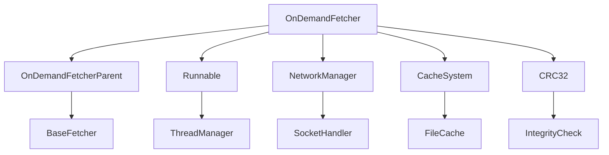

# OnDemandFetcher → GHOWLKWN

## Overview
OnDemandFetcher manages dynamic resource loading and caching for the game client. It implements Runnable for background downloading, handles CRC verification, manages file queues, and coordinates with the decompression system for efficient resource management during gameplay.

## Architecture
OnDemandFetcher extends OnDemandFetcherParent and implements Runnable to provide asynchronous resource loading. It manages network connections, file integrity checking, and integrates with the client's cache system. The class coordinates between network downloads, decompression, and the main game thread for seamless resource availability.



## Forensic Evidence Commands

### 1. Structural Fingerprints
```bash
# Show class inheritance and interfaces
head -5 bytecode/client/GHOWLKWN.bytecode.txt

# Show field count and types
grep -E "private.*int\|public.*String\|java\.util\.zip\.CRC32\|byte\[\]\[\]" bytecode/client/GHOWLKWN.bytecode.txt | wc -l
grep -E "private.*int\|public.*String\|java\.util\.zip\.CRC32\|byte\[\]\[\]" bytecode/client/GHOWLKWN.bytecode.txt

# Show method signatures
grep -E "public.*run\|private.*crcMatches\|private.*readData" bytecode/client/GHOWLKWN.bytecode.txt
```

### 2. Source Code Correlation
```bash
# Show DEOB class definition and inheritance
head -15 srcAllDummysRemoved/src/OnDemandFetcher.java

# Show key fields in source
grep -A 5 -B 2 "CRC32\|NodeList\|byte\[\]\[\]\|clientInstance" srcAllDummysRemoved/src/OnDemandFetcher.java

# Show javap cache field declarations
grep -A 10 -B 2 "CRC32\|NodeList\|ioBuffer\|fileStatus" srcAllDummysRemoved/.javap_cache/OnDemandFetcher.javap.cache
```

### 3. Network Operations Evidence
```bash
# Show socket and stream operations
grep -A 5 -B 5 "java\.io\.OutputStream\|Socket\|GZIPInputStream" bytecode/client/GHOWLKWN.bytecode.txt

# Show data reading operations
grep -A 10 -B 5 "available\|read.*ioBuffer\|inputStream" bytecode/client/GHOWLKWN.bytecode.txt

# Show corresponding source network operations
grep -A 10 -B 5 "inputStream\.available\|inputStream\.read\|GZIPInputStream" srcAllDummysRemoved/src/OnDemandFetcher.java
```

### 4. CRC Verification Evidence
```bash
# Show CRC32 operations
grep -A 5 -B 5 "CRC32\|crc32\.reset\|crc32\.update\|crc32\.getValue" bytecode/client/GHOWLKWN.bytecode.txt

# Show crcMatches method
grep -A 10 -B 5 "crcMatches" bytecode/client/GHOWLKWN.bytecode.txt

# Show source CRC verification
grep -A 15 -B 5 "crcMatches\|crc32\.reset\|crc32\.update" srcAllDummysRemoved/src/OnDemandFetcher.java
```

### 5. Cross-Reference Validation
```bash
# Verify unique mapping - no other classes reference GHOWLKWN
grep -r "GHOWLKWN" bytecode/client/ | grep -v "GHOWLKWN.bytecode.txt" | wc -l

# Show inheritance relationship in bytecode
grep -A 2 -B 2 "extends.*VJKFYAWG" bytecode/client/GHOWLKWN.bytecode.txt

# Show inheritance in DEOB source
grep -A 2 -B 2 "extends.*OnDemandFetcherParent.*implements.*Runnable" srcAllDummysRemoved/src/OnDemandFetcher.java

# Show Runnable implementation
grep -A 2 -B 2 "implements.*Runnable" bytecode/client/GHOWLKWN.bytecode.txt
```

## Sources and References
- **Bytecode**: bytecode/client/GHOWLKWN.bytecode.txt
- **Deobfuscated Source**: srcAllDummysRemoved/src/OnDemandFetcher.java
- **Javap Cache**: srcAllDummysRemoved/.javap_cache/OnDemandFetcher.javap.cache
- **Networking**: Socket and stream operations
- **Integrity**: CRC32 verification system
- **Caching**: NodeList queue management
- **Decompression**: Integration with Decompressor system</content>
<parameter name="filePath">bytecode/mapping/evidence/verified/OnDemandFetcher_GHOWLKWN.md