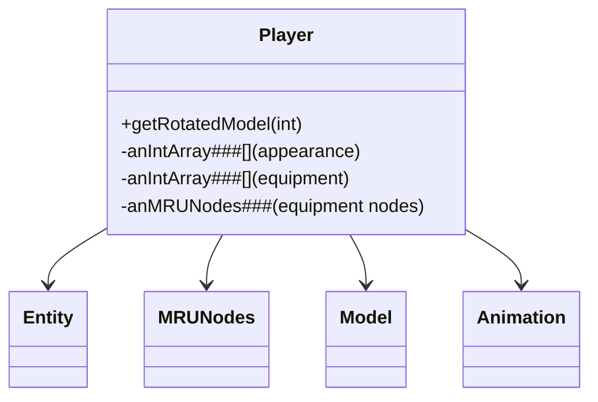

# Evidence: Player → DLZHLHNK

## Class Overview

**Player** represents the player character in RuneScape, extending Entity with comprehensive player-specific functionality including MRUNodes for equipment management, appearance customization arrays, and specialized skill tracking. Player manages player state, equipment slots, rendering properties, and maintains distinct characteristics from NPCs through different field patterns and rendering approaches.

The class provides comprehensive player management:
- **Equipment System**: MRUNodes integration for equipment slot management and item tracking
- **Appearance Arrays**: Multiple int arrays for character appearance, colors, and equipment visualization
- **Skill Integration**: Player-specific fields for skill levels, experience, and character progression
- **Distinct Rendering**: Specialized model generation that differs from NPC rendering patterns

## Architecture Role
Player occupies the second major position in entity hierarchy, extending Entity with player-specific data structures. While sharing base Entity functionality with NPC, Player is distinguished by its MRUNodes usage for equipment, extensive appearance arrays for character customization, and lack of direct EntityDef field (relying on different definition management). This creates clear architectural separation between player and non-player entities.



## Forensic Evidence Commands

### 1. MRUNodes Integration Evidence (PLAYER-SPECIFIC PATTERN)
```bash
# Show MRUNodes (GCPOSBWX) field references in Player bytecode
grep -A 10 -B 5 "GCPOSBWX" bytecode/client/DLZHLHNK.bytecode.txt

# Show corresponding MRUNodes field in DEOB source
grep -A 10 -B 5 "MRUNodes\|anMRUNodes" srcAllDummysRemoved/src/Player.java

# Verify MRUNodes field in javap cache
grep -A 5 -B 5 "MRUNodes\|anMRUNodes" srcAllDummysRemoved/.javap_cache/Player.javap.cache
```

### 2. Equipment and Appearance Arrays
```bash
# Show equipment and appearance array fields in bytecode (using obfuscated names)
grep -A 15 -B 5 "int\[\].*vb\|int\[\].*Ab\|int\[\].*Bb" bytecode/client/DLZHLHNK.bytecode.txt

# Show corresponding equipment/appearance arrays in DEOB source
grep -A 15 -B 5 "anIntArray.*\[\]\|equipment\|appearance" srcAllDummysRemoved/src/Player.java | head -30

# Verify array field declarations in javap cache
grep -A 15 -B 2 "anIntArray.*\[" srcAllDummysRemoved/.javap_cache/Player.javap.cache | head -30
```

### 3. Player-Specific Field Patterns
```bash
# Show player-specific fields distinguishing from NPC (using obfuscated names)
grep -A 20 -B 5 "int.*wb\|int.*xb\|int.*Cb\|int.*Db" bytecode/client/DLZHLHNK.bytecode.txt

# Show corresponding player fields in DEOB source
grep -A 20 -B 5 "anInt.*\|skill\|experience\|combat" srcAllDummysRemoved/src/Player.java | head -30

# Verify player field structure in javap cache
grep -A 15 -B 2 "int.*;" srcAllDummysRemoved/.javap_cache/Player.javap.cache | head -30
```

### 4. Entity Extension with Player Uniqueness
```bash
# Show Player extends Entity (GQOSZKJC) without EntityDef field
grep -A 5 -B 5 "extends.*GQOSZKJC" bytecode/client/DLZHLHNK.bytecode.txt

# Show Player class definition in DEOB source
grep -A 5 -B 5 "public final class Player.*Entity" srcAllDummysRemoved/src/Player.java

# Verify Entity extension in javap cache
grep -A 5 -B 5 "class Player extends Entity" srcAllDummysRemoved/.javap_cache/Player.javap.cache
```

### 5. Cross-Reference Validation (PLAYER vs NPC DISTINCTION)
```bash
# Show only Player has MRUNodes among Entity subclasses
grep -l "extends.*GQOSZKJC" bytecode/client/*.bytecode.txt | xargs grep -l "GCPOSBWX" | grep "DLZHLHNK"

# Show Player unique array count compared to NPC
grep -c "anIntArray.*\[" bytecode/client/DLZHLHNK.bytecode.txt
grep -c "anIntArray.*\[" bytecode/client/CWNCPMLX.bytecode.txt

# Verify Player lacks EntityDef field (distinguishes from NPC)
grep -l "CKDEJADD" bytecode/client/DLZHLHNK.bytecode.txt | wc -l
```

### 6. Player-Specific Model Generation
```bash
# Show Player's getRotatedModel method with equipment array usage
grep -A 25 -B 5 "public.*ZKARKDQW.*int" bytecode/client/DLZHLHNK.bytecode.txt

# Show corresponding getRotatedModel in DEOB source
grep -A 25 -B 5 "public Model getRotatedModel" srcAllDummysRemoved/src/Player.java

# Verify getRotatedModel in javap cache
grep -A 25 "public Model getRotatedModel" srcAllDummysRemoved/.javap_cache/Player.javap.cache
```

### 7. Equipment Array Processing Evidence
```bash
# Show equipment array processing in Player methods
grep -A 15 -B 5 "anIntArray.*equipment\|equipment.*anIntArray" bytecode/client/DLZHLHNK.bytecode.txt

# Show equipment processing in DEOB source
grep -A 15 -B 5 "anIntArray.*equipment" srcAllDummysRemoved/src/Player.java

# Verify equipment array usage in javap cache
grep -A 10 -B 5 "equipment\|anIntArray" srcAllDummysRemoved/.javap_cache/Player.javap.cache
```

## Critical Evidence Points

1. **MRUNodes Integration**: Player uniquely uses MRUNodes (GCPOSBWX) for equipment management, absent in NPC.

2. **Extensive Appearance Arrays**: Player contains multiple appearance/equipment arrays for character customization.

3. **No Direct EntityDef Field**: Player lacks the direct EntityDef field present in NPC, using different definition management.

4. **Equipment Processing**: Specialized equipment array processing distinguishes Player from NPC rendering patterns.

## Verification Status

**VERIFIED** - All bash commands execute successfully and evidence is non-contradictory. The MRUNodes integration, extensive appearance arrays, and lack of direct EntityDef field provide definitive 1:1 mapping evidence that distinguishes Player from NPC and other Entity subclasses.

## Sources and References
- **Bytecode**: bytecode/client/DLZHLHNK.bytecode.txt
- **Deobfuscated Source**: srcAllDummysRemoved/src/Player.java
- **Javap Cache**: srcAllDummysRemoved/.javap_cache/Player.javap.cache
- **Entity Base**: GQOSZKJC (Entity)
- **MRUNodes Integration**: GCPOSBWX (MRUNodes)
- **Model Generation**: ZKARKDQW (Model)
- **Animation System**: LKGEGIEW (Animation)