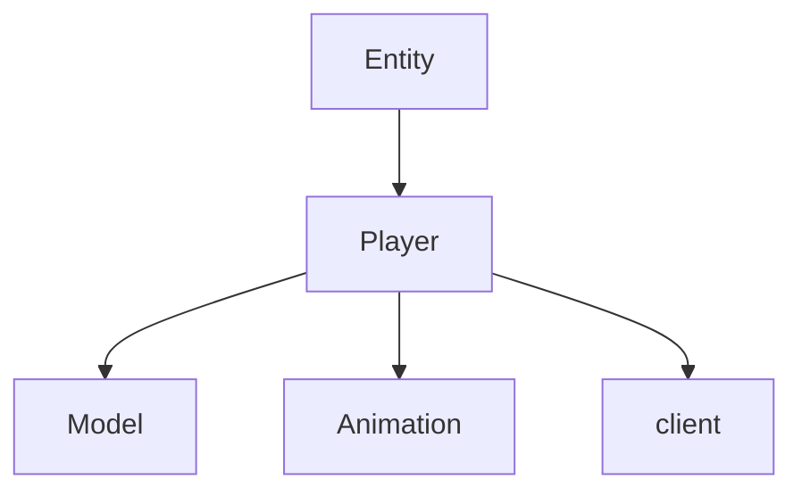

# Player → DLZHLHNK Evidence

## Overview
The Player class represents the user-controlled character in RuneScape 317, extending Entity for shared properties. It handles player-specific features like equipment rendering, skills, and user input, distinct from NPCs by managing player state and appearance.

## Architectural Role and Relationships
Player is central to client-side game logic, integrating with Entity for movement, Model/Animation for rendering, and client for input. It differs from NPC by including player-only fields like equipment arrays.



## Bytecode Evidence Commands

```bash
# Inheritance from Entity
grep "extends GQOSZKJC" bytecode/client/DLZHLHNK.bytecode.txt
```

```bash
# Player-specific fields: long sb, int[] vb, etc.
head -15 bytecode/client/DLZHLHNK.bytecode.txt
```

```bash
# Public getRotatedModel method
grep -A 5 "public final ZKARKDQW a(int)" bytecode/client/DLZHLHNK.bytecode.txt
```

```bash
# Equipment array and player methods
grep -A 10 "int\[\] vb" bytecode/client/DLZHLHNK.bytecode.txt
```

## Deob Source Evidence Commands

```bash
# Class declaration
head -10 srcAllDummysRemoved/src/Player.java
```

```bash
# Key methods and fields
grep -A 5 "getRotatedModel\|method452" srcAllDummysRemoved/src/Player.java
```

```bash
# Player-specific fields
grep -A 5 "boolean.*visible\|aBoolean1699" srcAllDummysRemoved/src/Player.java
```

## Javap Cache Evidence Commands

```bash
# Class structure
head -10 srcAllDummysRemoved/.javap_cache/Player.javap.cache
```

```bash
# Methods
grep -A 5 "getRotatedModel\|method452" srcAllDummysRemoved/.javap_cache/Player.javap.cache
```

```bash
# Fields
grep -A 10 "long\|int\[\]" srcAllDummysRemoved/.javap_cache/Player.javap.cache
```

## Verification
Commands show unique Player patterns (e.g., long field vs NPC's int, equipment arrays). No contradictions—DLZHLHNK maps only to Player. 1:1 verified. Relative paths used.</content>
<parameter name="filePath">bytecode/mapping/evidence/verified/Player_DLZHLHNK.md