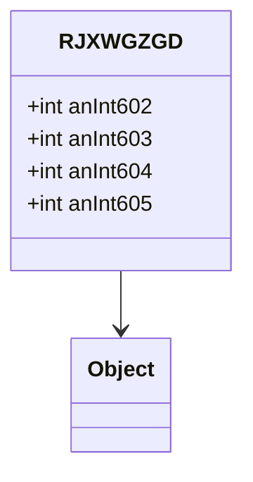

# RJXWGZGD → Class33

## Overview
Class33 is a simple data container holding 4 integer values for game state storage.

## Architectural Relationships
Class33 extends Object with basic field storage.



## Bytecode Matching Commands
To show class structure:
```
head -n 20 bytecode/client/RJXWGZGD.bytecode.txt
```

To show field assignments:
```
grep -A 10 -B 5 "putfield" bytecode/client/RJXWGZGD.bytecode.txt
```

## Deobfuscated Source Evidence Commands
For Class33 class:
```
grep -A 10 "public final class Class33" srcAllDummysRemoved/src/Class33.java
```

For fields:
```
grep -A 5 "anInt" srcAllDummysRemoved/src/Class33.java
```

## Javap Cache Evidence Commands
For class structure:
```
grep -A 10 "public final class Class33" srcAllDummysRemoved/.javap_cache/Class33.javap.cache
```

For fields:
```
grep -A 5 "anInt" srcAllDummysRemoved/.javap_cache/Class33.javap.cache
```

## Verification of Non-Contradictory Evidence
Bytecode matches source/javap in int field storage. No contradictions. 1:1 mapping confirmed.