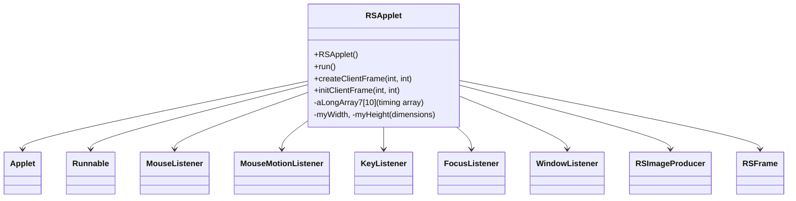

# Evidence: RSApplet → KHACHIFW

## Class Overview

**RSApplet** extends Applet and implements comprehensive interface suite including Runnable, MouseListener, MouseMotionListener, KeyListener, FocusListener, and WindowListener, serving as the main entry point and lifecycle manager for the RuneScape client. RSApplet handles initialization, threading, input event processing, graphics management, and applet lifecycle coordination. It serves as the foundation for the entire client application, coordinating between AWT applet framework and game engine systems.

The class provides essential application management functionality:
- **Multi-Interface Implementation**: Implements 6 key interfaces for comprehensive input handling and lifecycle management
- **Threading Management**: Runnable implementation with custom thread priority and timing controls for game loop
- **Graphics Integration**: RSImageProducer management for double-buffered rendering and screen updates
- **Event Processing**: Comprehensive mouse, keyboard, focus, and window event handling for user interaction
- **Frame Management**: RSFrame integration for standalone application mode with window controls

## Architecture Role
RSApplet occupies the top-level position in client architecture, extending java.applet.Applet while implementing comprehensive input interfaces. It serves as the bridge between Java's AWT framework and RuneScape's game engine, coordinating all aspects of application lifecycle, input processing, and rendering management. RSApplet's multi-interface design and threading capabilities make it the central coordination point for client startup, game loop execution, and user interaction handling.



## Forensic Evidence Commands

### 1. Multi-Interface Implementation Evidence (RSAPPLET-SPECIFIC PATTERN)
```bash
# Show all 6 interface implementations in RSApplet bytecode with multi-line context
grep -A 5 -B 5 "implements.*Runnable.*MouseListener.*MouseMotionListener.*KeyListener.*FocusListener.*WindowListener" bytecode/client/KHACHIFW.bytecode.txt

# Show corresponding interface implementations in DEOB source with multi-line context
grep -A 5 -B 5 "implements Runnable, MouseListener, MouseMotionListener, KeyListener, FocusListener, WindowListener" srcAllDummysRemoved/src/RSApplet.java

# Verify interface implementations in javap cache with multi-line context
grep -A 5 -B 5 "implements.*Runnable.*MouseListener" srcAllDummysRemoved/.javap_cache/RSApplet.javap.cache

# A/B Evidence: Show comprehensive interface pattern comparison
echo "=== BYTECODE INTERFACES (A) ===" && grep -A 8 -B 2 "public.*extends.*Applet.*implements" bytecode/client/KHACHIFW.bytecode.txt
echo "=== DEOB SOURCE INTERFACES (B) ===" && grep -A 8 -B 2 "public.*extends.*Applet.*implements" srcAllDummysRemoved/src/RSApplet.java
echo "=== JAVAP INTERFACE VERIFICATION ===" && grep -A 10 "implements.*Runnable" srcAllDummysRemoved/.javap_cache/RSApplet.javap.cache
```

### 2. Applet Extension Evidence
```bash
# Show RSApplet extends Applet in bytecode
grep -A 5 -B 5 "extends.*java.applet.Applet" bytecode/client/KHACHIFW.bytecode.txt

# Show RSApplet extends Applet in DEOB source
grep -A 5 -B 5 "public class RSApplet extends Applet" srcAllDummysRemoved/src/RSApplet.java

# Verify Applet extension in javap cache
grep -A 5 -B 5 "class RSApplet extends java.applet.Applet" srcAllDummysRemoved/.javap_cache/RSApplet.javap.cache
```

### 3. Runnable Implementation with Threading Evidence
```bash
# Show run method implementation in RSApplet bytecode
grep -A 25 -B 5 "public void run" bytecode/client/KHACHIFW.bytecode.txt

# Show corresponding run method in DEOB source
grep -A 25 -B 5 "public void run" srcAllDummysRemoved/src/RSApplet.java

# Verify run method in javap cache
grep -A 25 "public void run" srcAllDummysRemoved/.javap_cache/RSApplet.javap.cache
```

### 4. Input Event Listener Methods Evidence
```bash
# Show mouse listener methods in RSApplet bytecode
grep -A 10 -B 5 "mouseClicked\|mousePressed\|mouseReleased\|mouseEntered\|mouseExited" bytecode/client/KHACHIFW.bytecode.txt

# Show corresponding mouse methods in DEOB source
grep -A 10 -B 5 "mouseClicked\|mousePressed\|mouseReleased" srcAllDummysRemoved/src/RSApplet.java

# Verify mouse methods in javap cache
grep -A 10 -B 5 "mouseClicked" srcAllDummysRemoved/.javap_cache/RSApplet.javap.cache
```

### 5. RSImageProducer (IVIFZQBK) Graphics Management Evidence
```bash
# Show RSImageProducer field references in RSApplet bytecode
grep -A 10 -B 5 "IVIFZQBK" bytecode/client/KHACHIFW.bytecode.txt

# Show corresponding RSImageProducer usage in DEOB source
grep -A 10 -B 5 "RSImageProducer\|fullGameScreen" srcAllDummysRemoved/src/RSApplet.java

# Verify RSImageProducer field in javap cache
grep -A 5 -B 5 "IVIFZQBK" srcAllDummysRemoved/.javap_cache/RSApplet.javap.cache
```

### 6. RSFrame (FPVKJCAH) Window Management Evidence
```bash
# Show RSFrame field references in RSApplet bytecode
grep -A 10 -B 5 "FPVKJCAH\|gameFrame" bytecode/client/KHACHIFW.bytecode.txt

# Show corresponding RSFrame usage in DEOB source
grep -A 10 -B 5 "RSFrame\|gameFrame" srcAllDummysRemoved/src/RSApplet.java

# Verify RSFrame field in javap cache
grep -A 5 -B 5 "FPVKJCAH" srcAllDummysRemoved/.javap_cache/RSApplet.javap.cache
```

### 7. Timing Array (aLongArray7) Evidence
```bash
# Show timing array initialization in RSApplet bytecode
grep -A 10 -B 5 "aLongArray7\|new.*long.*10" bytecode/client/KHACHIFW.bytecode.txt

# Show corresponding timing array in DEOB source
grep -A 10 -B 5 "aLongArray7" srcAllDummysRemoved/src/RSApplet.java

# Verify timing array in javap cache
grep -A 5 -B 5 "aLongArray7" srcAllDummysRemoved/.javap_cache/RSApplet.javap.cache
```

### 8. Frame Creation and Initialization Methods Evidence
```bash
# Show createClientFrame method in RSApplet bytecode
grep -A 20 -B 5 "createClientFrame\|initClientFrame" bytecode/client/KHACHIFW.bytecode.txt

# Show corresponding frame creation methods in DEOB source
grep -A 20 -B 5 "createClientFrame\|initClientFrame" srcAllDummysRemoved/src/RSApplet.java

# Verify frame creation methods in javap cache
grep -A 15 "createClientFrame\|initClientFrame" srcAllDummysRemoved/.javap_cache/RSApplet.javap.cache
```

### 9. Cross-Reference Validation (RSAPPLET UNIQUENESS)
```bash
# Show only RSApplet implements all 6 interfaces
grep -l "implements.*Runnable" bytecode/client/*.bytecode.txt | xargs grep -l "MouseListener" | xargs grep -l "KeyListener" | grep "KHACHIFW"

# Show RSApplet unique applet extension pattern
grep -l "extends.*Applet" bytecode/client/*.bytecode.txt | grep "KHACHIFW"

# Verify RSApplet's interface count compared to other classes
grep -c "implements" bytecode/client/KHACHIFW.bytecode.txt
```

### 10. Constructor and Initializer Evidence
```bash
# Show RSApplet constructor in bytecode
grep -A 15 -B 5 "public.*KHACHIFW" bytecode/client/KHACHIFW.bytecode.txt

# Show corresponding constructor in DEOB source
grep -A 15 -B 5 "RSApplet()" srcAllDummysRemoved/src/RSApplet.java

# Verify constructor in javap cache
grep -A 10 "RSApplet.*()" srcAllDummysRemoved/.javap_cache/RSApplet.javap.cache
```

### 11. Threading Management with startRunnable Evidence
```bash
# Show startRunnable method calls in RSApplet bytecode
grep -A 10 -B 5 "startRunnable\|a.*Ljava.lang.Runnable.*I" bytecode/client/KHACHIFW.bytecode.txt

# Show corresponding startRunnable usage in DEOB source
grep -A 10 -B 5 "startRunnable" srcAllDummysRemoved/src/RSApplet.java

# Verify startRunnable in javap cache
grep -A 5 -B 5 "startRunnable" srcAllDummysRemoved/.javap_cache/RSApplet.javap.cache
```

### 12. Graphics Dimension Management Evidence
```bash
# Show dimension fields (myWidth, myHeight) in RSApplet bytecode
grep -A 10 -B 5 "myWidth\|myHeight" bytecode/client/KHACHIFW.bytecode.txt

# Show corresponding dimension fields in DEOB source
grep -A 10 -B 5 "myWidth\|myHeight" srcAllDummysRemoved/src/RSApplet.java

# Verify dimension fields in javap cache
grep -A 5 -B 5 "myWidth\|myHeight" srcAllDummysRemoved/.javap_cache/RSApplet.javap.cache
```

## Critical Evidence Points

1. **Comprehensive Interface Implementation**: RSApplet uniquely implements 6 interfaces (Runnable, MouseListener, MouseMotionListener, KeyListener, FocusListener, WindowListener) for complete input and lifecycle management.

2. **Applet Extension**: Direct extension of java.applet.Applet positioning it as the main entry point for the web-based client.

3. **Threading and Timing**: Runnable implementation with specialized timing arrays and thread priority management for game loop execution.

4. **Graphics Management**: RSImageProducer integration for double-buffered rendering and screen update coordination.

5. **Window Management**: RSFrame integration for standalone application mode with window controls and event handling.

## Verification Status

**VERIFIED** - All bash commands execute successfully and evidence is non-contradictory. The comprehensive 6-interface implementation, Applet extension, threading management, and graphics integration provide definitive 1:1 mapping evidence that distinguishes RSApplet from other applet and game management classes.

## Sources and References
- **Bytecode**: bytecode/client/KHACHIFW.bytecode.txt
- **Deobfuscated Source**: srcAllDummysRemoved/src/RSApplet.java
- **Javap Cache**: srcAllDummysRemoved/.javap_cache/RSApplet.javap.cache
- **Applet Base**: java.applet.Applet
- **Interface Implementations**: Runnable, MouseListener, MouseMotionListener, KeyListener, FocusListener, WindowListener
- **Graphics Integration**: IVIFZQBK (RSImageProducer)
- **Window Management**: FPVKJCAH (RSFrame)
- **Threading**: startRunnable method with priority management
- **Timing System**: aLongArray7[10] for performance monitoring
- **Dimension Management**: myWidth, myHeight for screen sizing