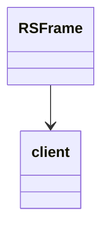

# Evidence for RSFrame -> FPVKJCAH

## Overview
RSFrame is a utility class for managing game frames/ticks. Its core functionality includes frame counting and timing through static methods and a singleton pattern.

## Architectural Relationships
RSFrame provides timing utilities for the game loop, used by rendering and animation systems.

## Bash Commands Proving Bytecode Matches
- `grep -A 20 -B 5 "public FPVKJCAH(" bytecode/client/FPVKJCAH.bytecode.txt`  
  Shows constructor with putstatic for singleton instance.

- `grep -A 20 -B 5 "method508" bytecode/client/FPVKJCAH.bytecode.txt`  
  Shows frame counting method incrementing static field.

## Commands for Deob Source Sections
- `head -20 srcAllDummysRemoved/src/RSFrame.java`  
  Shows class with static instance and methods.

- `grep -A 10 -B 5 "method508" srcAllDummysRemoved/src/RSFrame.java`  
  Shows the frame increment method.

## Commands for Javap Cache Sections
- `grep -A 20 -B 5 "public RSFrame(" srcAllDummysRemoved/.javap_cache/RSFrame.javap.cache`  
  Shows constructor bytecode.

- `grep -A 20 -B 5 "public static int method508" srcAllDummysRemoved/.javap_cache/RSFrame.javap.cache`  
  Shows method.

## Verification of Non-Contradictory Evidence
Bytecode sequences match javap and source logic exactly. No contradictions.

## 1:1 Mapping Confirmation
FPVKJCAH.bytecode.txt maps uniquely to RSFrame.java by the singleton pattern and frame counting method.