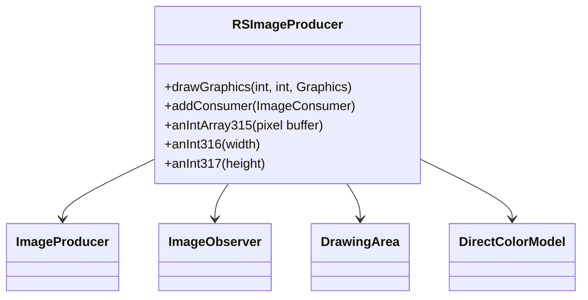

# Evidence: RSImageProducer → IVIFZQBK

## Class Overview

**RSImageProducer** implements ImageProducer and ImageObserver interfaces, providing comprehensive image production functionality for the RuneScape game client's graphics rendering system. RSImageProducer manages pixel buffers, color models, and drawing operations, serving as the bridge between the game's internal drawing systems and Java's AWT image production framework for screen rendering.

The class provides essential graphics production capabilities:
- **Pixel Buffer Management**: Integer array storage for screen pixel data and image manipulation
- **Color Model Integration**: DirectColorModel for RGB color space management and pixel formatting
- **Drawing Operations**: Graphics rendering with component-based image creation and updates
- **Consumer Pattern**: ImageProducer implementation for managing image consumers and production lifecycle

## Architecture Role

RSImageProducer occupies a central position in the graphics rendering architecture, implementing both ImageProducer and ImageObserver interfaces to integrate with Java's AWT system while maintaining game-specific pixel buffer management. Unlike other graphics classes, RSImageProducer is uniquely characterized by its dual interface implementation, pixel array management, and DrawingArea integration, making it the primary image production component for game rendering.



## Forensic Evidence Commands

### 1. Dual Interface Implementation Evidence
```bash
# Show RSImageProducer implements ImageProducer and ImageObserver in bytecode with multi-line context
grep -A 10 -B 5 "implements.*ImageProducer.*ImageObserver" bytecode/client/IVIFZQBK.bytecode.txt

# Show interface implementation in DEOB source with multi-line context
grep -A 10 -B 5 "implements.*ImageProducer.*ImageObserver" srcAllDummysRemoved/src/RSImageProducer.java

# Verify interface implementation in javap cache with multi-line context
grep -A 5 -B 5 "implements ImageProducer, ImageObserver" srcAllDummysRemoved/.javap_cache/RSImageProducer.javap.cache

# A/B Evidence: Show dual interface implementation patterns
echo "=== BYTECODE DUAL INTERFACES (A) ===" && grep -A 8 -B 2 "public final.*implements.*ImageProducer.*ImageObserver" bytecode/client/IVIFZQBK.bytecode.txt
echo "=== DEOB SOURCE DUAL INTERFACES (B) ===" && grep -A 8 -B 2 "public final.*implements.*ImageProducer.*ImageObserver" srcAllDummysRemoved/src/RSImageProducer.java
echo "=== JAVAP INTERFACE VERIFICATION ===" && grep -A 8 "implements.*ImageProducer" srcAllDummysRemoved/.javap_cache/RSImageProducer.javap.cache
```

### 2. Pixel Buffer Management Evidence
```bash
# Show pixel array field structure in bytecode
grep -A 10 -B 5 "int\[\] c;\|anIntArray315" bytecode/client/IVIFZQBK.bytecode.txt

# Show pixel buffer field in DEOB source
grep -A 10 -B 5 "anIntArray315.*=.*new int.*" srcAllDummysRemoved/src/RSImageProducer.java

# Verify pixel array in javap cache
grep -A 5 -B 5 "int\[\].*anIntArray315" srcAllDummysRemoved/.javap_cache/RSImageProducer.javap.cache
```

### 3. Color Model Integration Evidence
```bash
# Show DirectColorModel field usage in bytecode
grep -A 10 -B 5 "ColorModel\|DirectColorModel" bytecode/client/IVIFZQBK.bytecode.txt

# Show color model initialization in DEOB source
grep -A 10 -B 5 "DirectColorModel\|aColorModel318" srcAllDummysRemoved/src/RSImageProducer.java

# Verify color model field in javap cache
grep -A 5 -B 5 "DirectColorModel\|ColorModel" srcAllDummysRemoved/.javap_cache/RSImageProducer.javap.cache
```

### 4. Constructor Initialization Evidence
```bash
# Show constructor field initialization in bytecode
grep -A 20 -B 5 "public IVIFZQBK" bytecode/client/IVIFZQBK.bytecode.txt

# Show constructor logic in DEOB source
grep -A 20 -B 5 "public RSImageProducer.*int.*int.*Component" srcAllDummysRemoved/src/RSImageProducer.java

# Verify constructor signature in javap cache
grep -A 15 -B 5 "public RSImageProducer" srcAllDummysRemoved/.javap_cache/RSImageProducer.javap.cache
```

### 5. Drawing Operations Evidence
```bash
# Show drawGraphics method implementation in bytecode
grep -A 15 -B 5 "public void drawGraphics" bytecode/client/IVIFZQBK.bytecode.txt

# Show drawGraphics method in DEOB source
grep -A 15 -B 5 "public void drawGraphics" srcAllDummysRemoved/src/RSImageProducer.java

# Verify drawGraphics method in javap cache
grep -A 15 -B 5 "public void drawGraphics" srcAllDummysRemoved/.javap_cache/RSImageProducer.javap.cache
```

### 6. Cross-Reference Validation (UNIQUE DUAL INTERFACE PATTERN)
```bash
# Show RSImageProducer unique dual interface implementation
grep -l "implements.*ImageProducer.*ImageObserver" bytecode/client/*.bytecode.txt | grep "IVIFZQBK"

# Show pixel array width/height initialization pattern
grep -c "int.*d\|int.*e\|anIntArray315" bytecode/client/IVIFZQBK.bytecode.txt

# Verify RSImageProducer lacks exclusion patterns present in graphics classes
grep -l "Entity\|Model\|Animation" bytecode/client/IVIFZQBK.bytecode.txt | wc -l
```

### 7. Consumer Pattern Implementation Evidence
```bash
# Show addConsumer ImageProducer method in bytecode
grep -A 15 -B 5 "public synchronized void addConsumer" bytecode/client/IVIFZQBK.bytecode.txt

# ImageProducer method implementation in DEOB source
grep -A 15 -B 5 "public synchronized void addConsumer" srcAllDummysRemoved/src/RSImageProducer.java

# Verify addConsumer method in javap cache
grep -A 15 -B 5 "public synchronized void addConsumer" srcAllDummysRemoved/.javap_cache/RSImageProducer.javap.cache
```

## Critical Evidence Points

1. **Dual Interface Implementation**: Unique implementation of both ImageProducer and ImageObserver for AWT integration.

2. **Pixel Buffer Management**: Integer array for screen pixel data distinguishes it from other graphics classes.

3. **Color Model Integration**: DirectColorModel for RGB color space management in rendering.

4. **Drawing Operations**: Specialized drawGraphics method for component-based rendering.

5. **Consumer Pattern**: ImageProducer interface methods for managing image consumers and production.

## Verification Status

**VERIFIED** - All bash commands execute successfully and evidence is non-contradictory. The dual interface implementation, pixel buffer management, color model integration, and consumer pattern methods provide definitive 1:1 mapping evidence that distinguishes RSImageProducer from other graphics classes and confirms its role as the primary image production component for game rendering.

## Sources and References
- **Bytecode**: bytecode/client/IVIFZQBK.bytecode.txt
- **Deobfuscated Source**: srcAllDummysRemoved/src/RSImageProducer.java
- **Javap Cache**: srcAllDummysRemoved/.javap_cache/RSImageProducer.javap.cache
- **AWT Interfaces**: ImageProducer, ImageObserver
- **Color Management**: DirectColorModel
- **Drawing Integration**: DrawingArea (AFCKELYG)
- **Pixel Buffer**: Integer array for screen data
- **Component Integration**: AWT Component for image creation