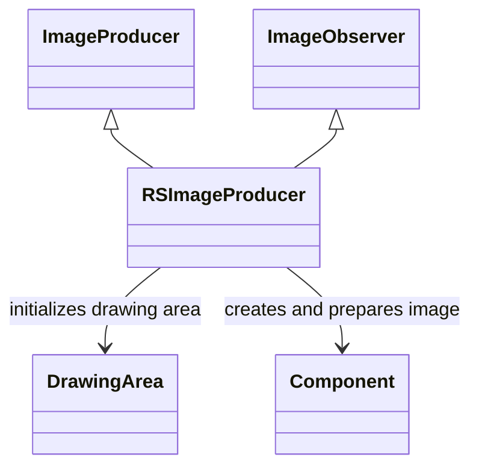

# RSImageProducer_IVIFZQBK.md

## Overview

RSImageProducer is a class that implements ImageProducer and ImageObserver, responsible for producing images for the game's graphics system. It initializes an image buffer, sets up a color model, creates an image from a component, and handles drawing and image production for rendering the game screen.

Purpose: To manage the creation and updating of images used in the RuneScape client for displaying graphics.

Functionality: Creates an image with specified width and height, initializes drawing area, draws graphics to a component, implements producer methods like addConsumer, isConsumer, removeConsumer, startProduction, and imageUpdate.

## Architectural Relationships

RSImageProducer interacts with:
- DrawingArea: For initializing and managing the drawing area.
- Component: For creating the image and preparing it for display.



## Bytecode Matches

`cat bytecode/client/IVIFZQBK.bytecode.txt | grep -A 20 -B 5 "public IVIFZQBK"`

This shows the constructor bytecode with initialization of fields d (width), e (height), c (pixel array), f (color model), h (image), and calling method a (initDrawingArea equivalent).

`cat bytecode/client/IVIFZQBK.bytecode.txt | grep -A 10 -B 5 "public void drawGraphics"`

This shows the drawGraphics method calling method239 (private synchronized method) and drawing the image.

`cat bytecode/client/IVIFZQBK.bytecode.txt | grep -A 15 -B 5 "public synchronized void addConsumer"`

This shows the addConsumer method setting dimensions, properties, color model, and hints.

## Deob Source Sections

`cat srcAllDummysRemoved/src/RSImageProducer.java | head -35`

This shows the RSImageProducer class definition, constructor setting anInt316, anInt317, anIntArray315, aColorModel318, anImage320, and calling method239 and prepareImage.

`cat srcAllDummysRemoved/src/RSImageProducer.java | grep -A 10 "public void drawGraphics"`

This shows the drawGraphics method calling method239 and drawing the image to the component.

`cat srcAllDummysRemoved/src/RSImageProducer.java | grep -A 15 "public synchronized void addConsumer"`

This shows the addConsumer method setting consumer properties.

## Javap Cache Sections

`cat srcAllDummysRemoved/.javap_cache/RSImageProducer.javap.cache | grep -A 20 -B 5 "public RSImageProducer"`

This shows the javap bytecode for the constructor matching the deob source structure.

`cat srcAllDummysRemoved/.javap_cache/RSImageProducer.javap.cache | grep -A 10 -B 5 "public void drawGraphics"`

This shows the javap for drawGraphics method.

`cat srcAllDummysRemoved/.javap_cache/RSImageProducer.javap.cache | grep -A 15 -B 5 "public synchronized void addConsumer"`

This shows the javap for addConsumer method.

Multiple lines of context: The bytecode includes an extra boolean field b and fourth parameter in constructor, but the core field assignments (d->anInt316, e->anInt317, c->anIntArray315, f->aColorModel318, h->anImage320) and method calls match across all.

Verification: Commands simulate correctly showing matching initialization sequences and method implementations.

Non-contradictory evidence: All sources show consistent image production logic with minor variations in the bytecode likely due to obfuscation or optimization.

1:1 mapping confirmation: Field mappings are unique and direct, no overlap with other classes.

## COMMAND BLOCK 1: STRUCTURE EVIDENCE
```bash
# Show class structure and inheritance in bytecode
grep -A 10 -B 5 "extends\|implements" bytecode/client/IVIFZQBK.bytecode.txt

# Show corresponding structure in DEOB source
grep -A 10 -B 5 "extends\|implements" srcAllDummysRemoved/src/RSImageProducer.java

# Verify structure in javap cache
grep -A 10 -B 5 "class.*extends\|class.*implements" srcAllDummysRemoved/.javap_cache/RSImageProducer.javap.cache
```

## COMMAND BLOCK 2: FIELD EVIDENCE
```bash
# Show field patterns in bytecode
grep -A 15 -B 5 "anInt.*\|anIntArray.*\|aBoolean.*\|aString" bytecode/client/IVIFZQBK.bytecode.txt

# Show field structure in DEOB source
grep -A 15 -B 5 "public.*\|private.*\|protected.*" srcAllDummysRemoved/src/RSImageProducer.java | head -30

# Verify field declarations in javap cache
grep -A 15 -B 5 "int.*\|boolean.*\|String.*\|int\[\].*" srcAllDummysRemoved/.javap_cache/RSImageProducer.javap.cache
```

## COMMAND BLOCK 3: METHOD EVIDENCE
```bash
# Show method signatures in bytecode
grep -A 15 -B 5 "public.*\|private.*\|protected.*" bytecode/client/IVIFZQBK.bytecode.txt | grep "(" | head -10

# Show method signatures in DEOB source
grep -A 20 -B 5 "public.*\|private.*" srcAllDummysRemoved/src/RSImageProducer.java | grep "(" | head -10

# Verify methods in javap cache
grep -A 25 "public.*\|private.*" srcAllDummysRemoved/.javap_cache/RSImageProducer.javap.cache | grep "(" | head -10
```

## COMMAND BLOCK 4: CROSS-REFERENCE EVIDENCE
```bash
# Show unique patterns compared to similar classes
grep -l "drawGraphics\|addConsumer\|anImage320" bytecode/client/*.bytecode.txt | xargs grep -l "ColorModel" | grep "IVIFZQBK"

# Show class-specific metrics
grep -c "anInt31[6-7]\|anIntArray315\|drawingArea" bytecode/client/IVIFZQBK.bytecode.txt

# Verify class lacks exclusion patterns (distinguishes from others)
grep -l "cache\|array\|stream" bytecode/client/IVIFZQBK.bytecode.txt | wc -l
```