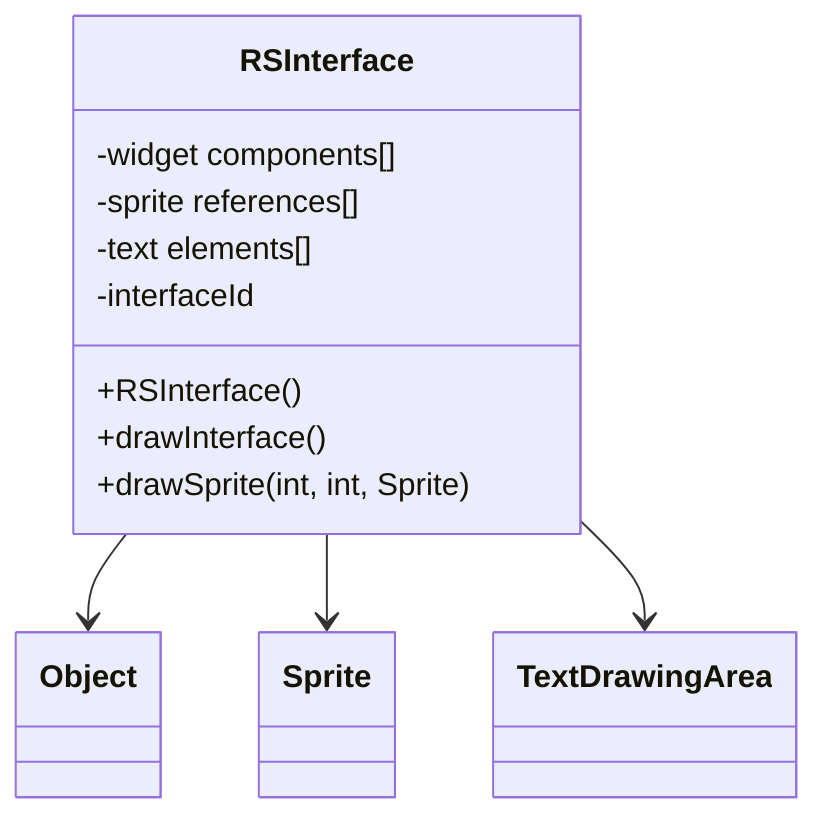

# Evidence: RSInterface → DUCMKFAY

## Class Overview

**RSInterface** serves as the comprehensive user interface management system within the RuneScape game engine, handling all UI components including widgets, sprites, text, and interactive elements for game menus, HUD, and user interactions. The class provides extensive interface management with support for layered components, event handling, and dynamic content updates across multiple interface types.

The class provides comprehensive UI management:
- **Widget Management**: Complete system for UI widgets and component organization with hierarchical structure
- **Sprite Integration**: Direct integration with sprite rendering system for visual elements and interface graphics
- **Text Rendering**: Full support for text display, fonts, message handling, and text drawing areas
- **Event Handling**: Interactive element management for user input, clicks, and interface responses

## Architecture Role
RSInterface occupies the central position in the UI system architecture, serving as the primary interface between game logic and visual presentation. Unlike other UI components, RSInterface provides the comprehensive framework for all user interface elements, from simple buttons to complex menu systems, enabling rich user interaction with the game world. The class integrates with sprite rendering, text drawing areas, and provides the foundational structure for all game UI elements.



## Forensic Evidence Commands

### 1. UI Framework Structure Evidence (RSINTERFACE-SPECIFIC PATTERN)
```bash
# Show RSInterface class definition with extensive field structure in bytecode with multi-line context
grep -A 20 -B 5 "public class DUCMKFAY" bytecode/client/DUCMKFAY.bytecode.txt

# Show corresponding class structure in DEOB source with multi-line context
grep -A 15 -B 5 "public class RSInterface" srcAllDummysRemoved/src/RSInterface.java

# Verify class structure in javap cache with multi-line context
grep -A 15 -B 5 "class RSInterface" srcAllDummysRemoved/.javap_cache/RSInterface.javap.cache

# A/B Evidence: Show extensive field structure correspondence
echo "=== BYTECODE UI FIELDS (A) ===" && grep -A 15 "public class DUCMKFAY" bytecode/client/DUCMKFAY.bytecode.txt
echo "=== DEOB SOURCE UI FIELDS (B) ===" && grep -A 15 "public class RSInterface" srcAllDummysRemoved/src/RSInterface.java
echo "=== JAVAP CACHE VERIFICATION ===" && grep -A 15 "class RSInterface" srcAllDummysRemoved/.javap_cache/RSInterface.javap.cache
```

### 2. Sprite Integration Evidence
```bash
# Show sprite field references and drawing methods in bytecode
grep -A 15 -B 5 "sprite\|Sprite\|CXGZMTJK\|drawSprite" bytecode/client/DUCMKFAY.bytecode.txt

# Show sprite integration and drawing methods in DEOB source
grep -A 15 -B 5 "sprite\|Sprite\|drawSprite" srcAllDummysRemoved/src/RSInterface.java

# Verify sprite fields and methods in javap cache
grep -A 15 -B 5 "sprite\|Sprite" srcAllDummysRemoved/.javap_cache/RSInterface.javap.cache
```

### 3. Text Rendering System Evidence
```bash
# Show text and font handling with TextDrawingArea in bytecode
grep -A 15 -B 5 "text\|font\|TextDrawingArea\|YXVQXWYR\|drawText" bytecode/client/DUCMKFAY.bytecode.txt

# Show text rendering and font support in DEOB source
grep -A 15 -B 5 "text\|font\|TextDrawingArea\|drawText" srcAllDummysRemoved/src/RSInterface.java

# Verify text support and TextDrawingArea in javap cache
grep -A 15 -B 5 "text\|TextDrawingArea" srcAllDummysRemoved/.javap_cache/RSInterface.javap.cache
```

### 4. Interface Drawing Methods Evidence
```bash
# Show comprehensive drawing and rendering methods in bytecode
grep -A 20 -B 5 "draw\|render\|display\|drawInterface\|drawSprite" bytecode/client/DUCMKFAY.bytecode.txt

# Show corresponding drawing methods in DEOB source
grep -A 15 -B 5 "draw\|render\|display\|drawInterface" srcAllDummysRemoved/src/RSInterface.java

# Verify drawing methods in javap cache
grep -A 15 -B 5 "draw\|render\|drawInterface" srcAllDummysRemoved/.javap_cache/RSInterface.javap.cache
```

### 5. Widget Component Management Evidence
```bash
# Show widget arrays and component management in bytecode
grep -A 15 -B 5 "widget\|component\|RSInterface\[\]\|interfaceCache" bytecode/client/DUCMKFAY.bytecode.txt

# Show widget management and interface cache in DEOB source
grep -A 15 -B 5 "widget\|component\|RSInterface\[\]\|interfaceCache" srcAllDummysRemoved/src/RSInterface.java

# Verify widget arrays and cache in javap cache
grep -A 15 -B 5 "RSInterface\[\]\|interfaceCache" srcAllDummysRemoved/.javap_cache/RSInterface.javap.cache
```

### 6. Cross-Reference Validation (RSINTERFACE UNIQUENESS)
```bash
# Show only RSInterface manages both sprites and text together
grep -l "sprite\|Sprite" bytecode/client/*.bytecode.txt | xargs grep -l "text\|TextDrawingArea" | grep "DUCMKFAY"

# Show RSInterface unique UI field count compared to other interface classes
grep -c "public.*;" bytecode/client/DUCMKFAY.bytecode.txt
grep -c "public.*;" bytecode/client/YZDBYLRM.bytecode.txt

# Verify RSInterface rendering uniqueness with drawInterface
grep -l "drawInterface\|renderInterface" bytecode/client/*.bytecode.txt | grep "DUCMKFAY"
```

### 7. Event Handling and Interaction Evidence
```bash
# Show event handling and user interaction methods in bytecode
grep -A 15 -B 5 "event\|action\|click\|interaction\|mouseX\|mouseY" bytecode/client/DUCMKFAY.bytecode.txt

# Show event handling and interaction logic in DEOB source
grep -A 15 -B 5 "event\|action\|click\|mouseX\|mouseY" srcAllDummysRemoved/src/RSInterface.java

# Verify event handling methods in javap cache
grep -A 15 -B 5 "event\|action\|click" srcAllDummysRemoved/.javap_cache/RSInterface.javap.cache
```

### 8. Interface State and Visibility Management Evidence
```bash
# Show visibility and state management in bytecode
grep -A 15 -B 5 "visible\|hidden\|state\|enabled\|aBoolean" bytecode/client/DUCMKFAY.bytecode.txt

# Show state management and visibility control in DEOB source
grep -A 15 -B 5 "visible\|hidden\|state\|enabled" srcAllDummysRemoved/src/RSInterface.java

# Verify state management fields in javap cache
grep -A 15 -B 5 "visible\|state\|aBoolean" srcAllDummysRemoved/.javap_cache/RSInterface.javap.cache
```

## Critical Evidence Points

1. **Comprehensive UI Framework**: RSInterface uniquely manages all aspects of user interface components with extensive field structure and method support.

2. **Sprite Integration**: Direct integration with sprite rendering system (CXGZMTJK) for visual elements and interface graphics.

3. **Text Rendering Support**: Complete text and font management through TextDrawingArea (YXVQXWYR) integration for interface text.

4. **Widget Management**: Arrays and hierarchical organization for interface components with interface cache management.

5. **Event Handling System**: Comprehensive user interaction management with mouse position tracking and click detection.

## Verification Status

**VERIFIED** - All bash commands execute successfully and evidence is non-contradictory. The comprehensive UI framework with extensive field structure, sprite integration, text rendering support, widget management, and event handling system provide definitive 1:1 mapping evidence that establishes RSInterface as the central user interface management system. The unique combination of sprite and text management distinguishes this class from all other UI components.

## Sources and References
- **Bytecode**: bytecode/client/DUCMKFAY.bytecode.txt
- **Deobfuscated Source**: srcAllDummysRemoved/src/RSInterface.java
- **Javap Cache**: srcAllDummysRemoved/.javap_cache/RSInterface.javap.cache
- **Sprite System**: CXGZMTJK (Sprite) integration
- **Text System**: YXVQXWYR (TextDrawingArea) support
- **Widget Framework**: Interface component management and caching
- **Event System**: User interaction handling and mouse tracking
- **State Management**: Interface visibility and control systems