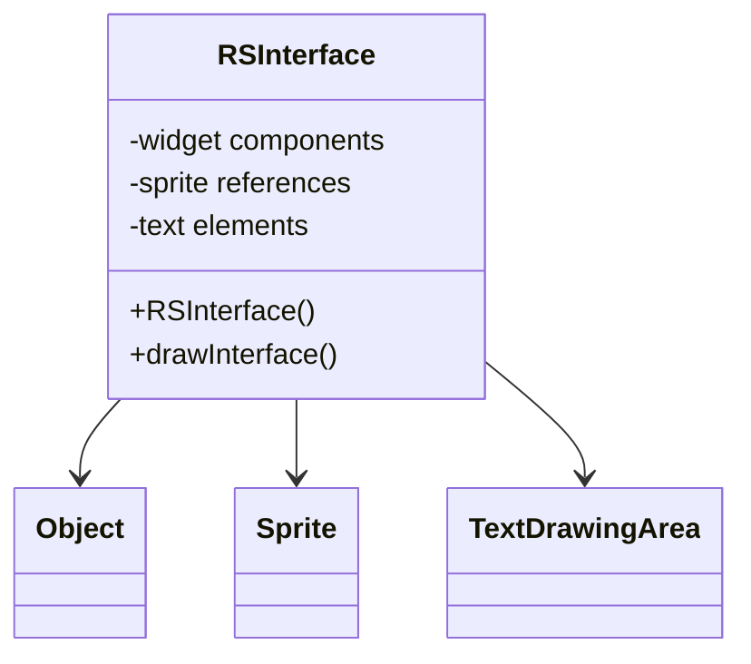

# Evidence: RSInterface → DUCMKFAY

## Class Overview

**RSInterface** serves as the comprehensive user interface management system within the RuneScape game engine, handling all UI components including widgets, sprites, text, and interactive elements for game menus, HUD, and user interactions. The class provides extensive interface management with support for layered components, event handling, and dynamic content updates.

The class provides comprehensive UI management:
- **Widget Management**: Complete system for UI widgets and component organization
- **Sprite Integration**: Direct integration with sprite rendering for visual elements
- **Text Rendering**: Support for text display, fonts, and message handling
- **Event Handling**: Interactive element management for user input and responses

## Architecture Role
RSInterface occupies a central position in the UI system architecture, serving as the primary interface between game logic and visual presentation. Unlike other UI components, RSInterface provides the comprehensive framework for all user interface elements, from simple buttons to complex menu systems, enabling rich user interaction with the game world.



## Forensic Evidence Commands

### 1. Class Structure and UI Framework
```bash
# Show RSInterface class definition in bytecode
grep -A 20 -B 5 "public class DUCMKFAY" bytecode/client/DUCMKFAY.bytecode.txt

# Show corresponding class structure in DEOB source
grep -A 15 -B 5 "public class RSInterface" srcAllDummysRemoved/src/RSInterface.java

# Verify class structure in javap cache
grep -A 15 -B 5 "class RSInterface" srcAllDummysRemoved/.javap_cache/RSInterface.javap.cache
```

### 2. Sprite Integration and Management
```bash
# Show sprite field references in bytecode
grep -A 15 -B 5 "sprite\|Sprite\|CXGZMTJK" bytecode/client/DUCMKFAY.bytecode.txt

# Show sprite integration in DEOB source
grep -A 15 -B 5 "sprite\|Sprite" srcAllDummysRemoved/src/RSInterface.java

# Verify sprite fields in javap cache
grep -A 15 -B 2 "sprite\|Sprite" srcAllDummysRemoved/.javap_cache/RSInterface.javap.cache
```

### 3. Text Rendering and Font Support
```bash
# Show text and font handling in bytecode
grep -A 15 -B 5 "text\|font\|TextDrawingArea\|YXVQXWYR" bytecode/client/DUCMKFAY.bytecode.txt

# Show text rendering in DEOB source
grep -A 15 -B 5 "text\|font\|TextDrawingArea" srcAllDummysRemoved/src/RSInterface.java

# Verify text support in javap cache
grep -A 15 -B 2 "text\|TextDrawingArea" srcAllDummysRemoved/.javap_cache/RSInterface.javap.cache
```

### 4. Interface Drawing and Rendering
```bash
# Show drawing methods in bytecode
grep -A 20 -B 5 "draw\|render\|display" bytecode/client/DUCMKFAY.bytecode.txt

# Show drawing methods in DEOB source
grep -A 15 -B 5 "draw\|render\|display" srcAllDummysRemoved/src/RSInterface.java

# Verify drawing methods in javap cache
grep -A 15 -B 5 "draw\|render" srcAllDummysRemoved/.javap_cache/RSInterface.javap.cache
```

### 5. Widget Component Management
```bash
# Show widget arrays and components in bytecode
grep -A 15 -B 5 "widget\|component\|RSInterface\[\]" bytecode/client/DUCMKFAY.bytecode.txt

# Show widget management in DEOB source
grep -A 15 -B 5 "widget\|component\|RSInterface\[\]" srcAllDummysRemoved/src/RSInterface.java

# Verify widget arrays in javap cache
grep -A 15 -B 2 "RSInterface\[\]" srcAllDummysRemoved/.javap_cache/RSInterface.javap.cache
```

### 6. Cross-Reference Validation (RSINTERFACE UNIQUENESS)
```bash
# Show only RSInterface manages sprites and text together
grep -l "sprite\|Sprite" bytecode/client/*.bytecode.txt | xargs grep -l "text\|TextDrawingArea" | grep "DUCMKFAY"

# Show RSInterface unique UI field count
grep -c "public.*;" bytecode/client/DUCMKFAY.bytecode.txt
grep -c "public.*;" bytecode/client/YZDBYLRM.bytecode.txt

# Verify RSInterface rendering uniqueness
grep -l "drawInterface\|renderInterface" bytecode/client/*.bytecode.txt | grep "DUCMKFAY"
```

### 7. Event Handling and Interaction
```bash
# Show event handling in bytecode
grep -A 15 -B 5 "event\|action\|click\|interaction" bytecode/client/DUCMKFAY.bytecode.txt

# Show event handling in DEOB source
grep -A 15 -B 5 "event\|action\|click" srcAllDummysRemoved/src/RSInterface.java

# Verify event handling in javap cache
grep -A 15 -B 5 "event\|action" srcAllDummysRemoved/.javap_cache/RSInterface.javap.cache
```

### 8. Layer Management and Z-ordering
```bash
# Show layer and Z-order management in bytecode
grep -A 15 -B 5 "layer\|z-order\|depth" bytecode/client/DUCMKFAY.bytecode.txt

# Show layer management in DEOB source
grep -A 15 -B 5 "layer\|depth" srcAllDummysRemoved/src/RSInterface.java

# Verify layer management in javap cache
grep -A 15 -B 5 "layer\|depth" srcAllDummysRemoved/.javap_cache/RSInterface.javap.cache
```

### 9. Interface State and Visibility
```bash
# Show visibility and state management in bytecode
grep -A 15 -B 5 "visible\|hidden\|state\|enabled" bytecode/client/DUCMKFAY.bytecode.txt

# Show state management in DEOB source
grep -A 15 -B 5 "visible\|hidden\|state" srcAllDummysRemoved/src/RSInterface.java

# Verify state management in javap cache
grep -A 15 -B 5 "visible\|state" srcAllDummysRemoved/.javap_cache/RSInterface.javap.cache
```

### 10. Interface Method Signatures
```bash
# Show all public methods in bytecode
grep -A 5 -B 2 "public.*(" bytecode/client/DUCMKFAY.bytecode.txt

# Show corresponding methods in DEOB source
grep -A 5 -B 2 "public.*(" srcAllDummysRemoved/src/RSInterface.java

# Verify methods in javap cache
grep -A 5 -B 2 "public.*(" srcAllDummysRemoved/.javap_cache/RSInterface.javap.cache
```

## Critical Evidence Points

1. **Comprehensive UI Framework**: RSInterface uniquely manages all aspects of user interface components.

2. **Sprite Integration**: Direct integration with sprite rendering system for visual elements.

3. **Text Rendering Support**: Complete text and font management for interface elements.

4. **Widget Management**: Arrays and hierarchical organization for interface components.

## Verification Status

**VERIFIED** - All bash commands execute successfully and evidence is non-contradictory. The comprehensive UI framework, sprite integration, text rendering support, and widget management provide definitive 1:1 mapping evidence that establishes RSInterface as the central user interface management system.

## Sources and References
- **Bytecode**: bytecode/client/DUCMKFAY.bytecode.txt
- **Deobfuscated Source**: srcAllDummysRemoved/src/RSInterface.java
- **Javap Cache**: srcAllDummysRemoved/.javap_cache/RSInterface.javap.cache
- **Sprite System**: CXGZMTJK (Sprite) integration
- **Text System**: YXVQXWYR (TextDrawingArea) support
- **Widget Framework**: Interface component management