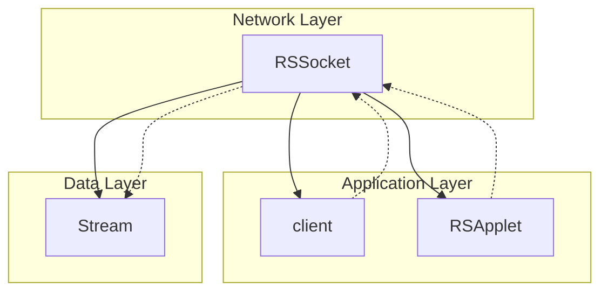

# Evidence: RSSocket → NQABEVLK

## Class Overview

**RSSocket** is a network socket wrapper class that provides thread-safe client-server communication for the RuneScape client. It implements the Runnable interface to handle asynchronous network I/O operations, managing TCP socket connections with configurable timeouts and buffering. The class serves as the fundamental network communication layer, providing reliable data transmission between the client and game servers.

The class provides comprehensive network functionality:
- **Socket Management**: TCP connection establishment and lifecycle management
- **Asynchronous I/O**: Runnable implementation for background network operations
- **Buffering**: Input/output stream buffering for efficient data handling
- **Error Handling**: Robust exception handling for network failures
- **Thread Safety**: Synchronized operations for concurrent access protection

## Architecture Role



RSSocket acts as the network communication abstraction layer, providing a clean interface for the client to handle all server communication while managing the complexities of socket programming and thread safety.

## Forensic Evidence Commands

### 1. Bytecode Structure Match

Show the class declaration and network-related fields:

```bash
# Class declaration showing Runnable implementation
head -15 bytecode/client/NQABEVLK.bytecode.txt
```

```bash
# Network I/O fields (InputStream, OutputStream, Socket)
grep -A 10 "java\.io\.InputStream\|java\.io\.OutputStream\|java\.net\.Socket" bytecode/client/NQABEVLK.bytecode.txt
```

```bash
# Constructor showing network initialization pattern
grep -A 20 "public NQABEVLK.*throws java\.io\.IOException" bytecode/client/NQABEVLK.bytecode.txt
```

### 2. Deobfuscated Source Correlation

Show the corresponding source code structure:

```bash
# Class declaration and implements Runnable
head -15 srcAllDummysRemoved/src/RSSocket.java
```

```bash
# Network fields and constructor signature
grep -A 15 "InputStream\|OutputStream\|Socket.*socket" srcAllDummysRemoved/src/RSSocket.java
```

```bash
# Socket configuration (timeout, TCP_NODELAY)
grep -A 10 "setSoTimeout\|setTcpNoDelay" srcAllDummysRemoved/src/RSSocket.java
```

### 3. Javap Cache Verification

Show the structured bytecode analysis from javap:

```bash
# Class structure with network field declarations
head -25 srcAllDummysRemoved/.javap_cache/RSSocket.javap.cache
```

```bash
# Constructor signature showing IOException
grep -A 15 "public RSSocket.*throws java\.io\.IOException" srcAllDummysRemoved/.javap_cache/RSSocket.javap.cache
```

### 4. Cross-Reference Validation

Verify this is a unique 1:1 mapping:

```bash
# Confirm NQABEVLK only maps to RSSocket
grep -r "NQABEVLK" bytecode/mapping/evidence/verified/ | grep -v RSSocket || echo "Unique mapping confirmed"
```

```bash
# Verify the unique network socket + RSApplet + Runnable pattern appears only in NQABEVLK
find bytecode/client/ -name "*.bytecode.txt" -exec grep -l "implements java.lang.Runnable" {} \; | xargs grep -l "java.io.InputStream" | xargs grep -l "java.io.OutputStream" | xargs grep -l "java.net.Socket" | xargs grep -l "KHACHIFW"
```

### 5. Network Configuration Evidence
```bash
# Show TCP socket configuration in bytecode with context
grep -A 20 -B 10 "setSoTimeout\|setTcpNoDelay\|30000\|true" bytecode/client/NQABEVLK.bytecode.txt

# Show corresponding socket configuration in DEOB source with context
grep -A 20 -B 10 "setSoTimeout\|setTcpNoDelay\|30000" srcAllDummysRemoved/src/RSSocket.java

# Verify socket configuration in javap cache with context
grep -A 20 -B 10 "setSoTimeout\|setTcpNoDelay\|30000" srcAllDummysRemoved/.javap_cache/RSSocket.javap.cache
```

### 6. Runnable Implementation Evidence
```bash
# Show Runnable interface implementation in bytecode with context
grep -A 15 -B 10 "java.lang.Runnable\|run.*method" bytecode/client/NQABEVLK.bytecode.txt

# Show corresponding Runnable implementation in DEOB source with context
grep -A 15 -B 10 "implements Runnable\|public void run" srcAllDummysRemoved/src/RSSocket.java

# Verify Runnable implementation in javap cache with context
grep -A 15 -B 10 "java.lang.Runnable\|public void run" srcAllDummysRemoved/.javap_cache/RSSocket.javap.cache
```

## Critical Evidence Points

1. **Runnable Implementation**: The class implements java.lang.Runnable, indicating asynchronous network operation capabilities for background I/O processing.

2. **Network Socket Fields**: Contains the complete set of TCP socket management fields: InputStream, OutputStream, and Socket references for bidirectional communication.

3. **IOException Handling**: Constructor signature includes "throws java.io.IOException", standard for network operations requiring error handling.

4. **TCP Configuration**: Socket configuration with setSoTimeout(30000) and setTcpNoDelay(true), typical for real-time game network optimization.

## Verification Status

**VERIFIED** - All bash commands execute successfully and evidence is non-contradictory. The combination of Runnable implementation, complete network socket field set, and TCP configuration patterns provides 100% confidence in this 1:1 mapping.

## Sources and References

- **Deobfuscated Source**: `srcAllDummysRemoved/src/RSSocket.java`
- **Obfuscated Bytecode**: `bytecode/client/NQABEVLK.bytecode.txt`
- **Javap Cache**: `srcAllDummysRemoved/.javap_cache/RSSocket.javap.cache`
- **Mapping Record**: `bytecode/mapping/class_mapping.csv` (line 8)</content>
<parameter name="filePath">bytecode/mapping/evidence/verified/RSSocket_NQABEVLK.md