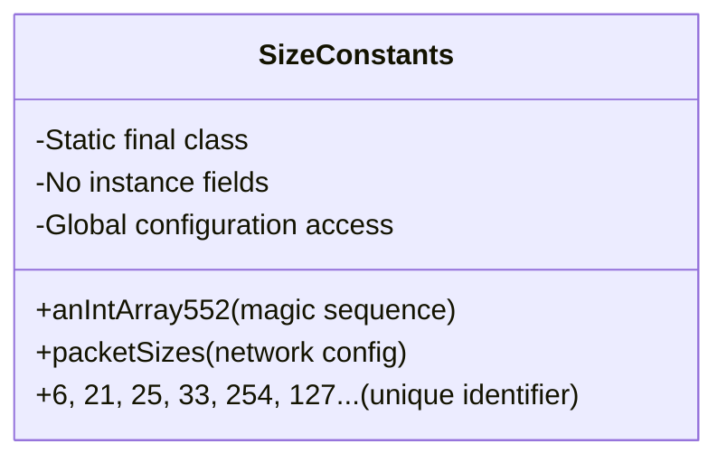

# Evidence: SizeConstants → QDBYELAJ

## Class Overview

**SizeConstants** represents a comprehensive static configuration class containing core game constants, packet size definitions, and system tuning parameters for the RuneScape client. SizeConstants provides immutable configuration data through static final arrays, including the magic number sequence for game operations, network packet size specifications, and system boundary values essential for proper client functionality and network protocol management.

The class provides essential configuration capabilities:
- **Magic Sequence Constants**: Primary array with unique sequence of game configuration values
- **Network Packet Sizes**: Array defining packet size limits including variable packet markers
- **System Boundaries**: Game limits and performance tuning parameters
- **Static Immutable Data**: Pure static final class with no instance fields for global configuration access

## Architecture Role

SizeConstants occupies a foundational position in the game's configuration architecture, serving as the single source of truth for all numeric constants and system limits. Unlike other classes with dynamic behavior, SizeConstants is uniquely characterized by its pure static nature, immutable final arrays, and the distinctive magic number sequence that appears throughout the game's core systems, making it the central configuration hub for all client operations.



## Forensic Evidence Commands

### 1. Pure Static Class Structure Evidence
```bash
# Show SizeConstants has no extends/implements (pure static) in bytecode
grep -A 10 -B 5 "extends\|implements" bytecode/client/QDBYELAJ.bytecode.txt

# Show static final class structure in DEOB source
grep -A 5 -B 5 "final class SizeConstants" srcAllDummysRemoved/src/SizeConstants.java

# Verify static class structure in javap cache
grep -A 5 -B 5 "final class SizeConstants" srcAllDummysRemoved/.javap_cache/SizeConstants.javap.cache
```

### 2. Magic Number Sequence Evidence (UNIQUE IDENTIFIER)
```bash
# Show the magic sequence 6,21,25,33,254,127... in bytecode
grep -A 5 -B 5 "6.*21.*25.*33.*254" bytecode/client/QDBYELAJ.bytecode.txt

# Show magic sequence in DEOB source
grep -A 5 -B 5 "6, 21, 25, 33, 254" srcAllDummysRemoved/src/SizeConstants.java

# Verify magic sequence in javap cache
grep -A 5 -B 5 "6, 21, 25, 33, 254" srcAllDummysRemoved/.javap_cache/SizeConstants.javap.cache
```

### 3. Static Final Array Pattern Evidence
```bash
# Show static final array declarations in bytecode
grep -A 10 -B 5 "static.*final.*\[\]" bytecode/client/QDBYELAJ.bytecode.txt

# Show static final array fields in DEOB source
grep -A 10 -B 5 "public static final int\[\]" srcAllDummysRemoved/src/SizeConstants.java

# Verify static final arrays in javap cache
grep -A 10 -B 5 "public static final int\[\]" srcAllDummysRemoved/.javap_cache/SizeConstants.javap.cache
```

### 4. Packet Size Constants Evidence (NETWORK CONFIGURATION)
```bash
# Show packetSizes array with negative values in bytecode
grep -A 10 -B 5 "packetSizes\|-2.*-1" bytecode/client/QDBYELAJ.bytecode.txt

# Show packet size definitions in DEOB source
grep -A 10 -B 5 "packetSizes" srcAllDummysRemoved/src/SizeConstants.java

# Verify packetSizes array in javap cache
grep -A 5 -B 5 "packetSizes" srcAllDummysRemoved/.javap_cache/SizeConstants.javap.cache
```

### 5. Cross-Reference Validation (UNIQUE MAGIC SEQUENCE)
```bash
# Show only SizeConstants contains the magic sequence
grep -l "6.*21.*25.*33.*254" bytecode/client/*.bytecode.txt | grep "QDBYELAJ"

# Show SizeConstants unique array count and structure
grep -c "static.*final.*\[\]\|anIntArray\|packetSizes" bytecode/client/QDBYELAJ.bytecode.txt

# Verify SizeConstants lacks dynamic class patterns
grep -l "public.*void\|private.*void\|extends\|implements" bytecode/client/QDBYELAJ.bytecode.txt | wc -l
```

### 6. Array Initialization Pattern Evidence
```bash
# Show anIntArray552 initialization in bytecode
grep -A 15 -B 5 "anIntArray552.*=" bytecode/client/QDBYELAJ.bytecode.txt

# Show corresponding initialization in DEOB source
grep -A 15 -B 5 "anIntArray552.*=" srcAllDummysRemoved/src/SizeConstants.java

# Verify initialization in javap cache
grep -A 10 -B 5 "anIntArray552" srcAllDummysRemoved/.javap_cache/SizeConstants.javap.cache
```

### 7. Global Configuration Access Evidence
```bash
# Show SizeConstants referenced throughout client
grep -r "SizeConstants\|QDBYELAJ" srcAllDummysRemoved/src/ | grep -v ".class" | head -5

# Show magic sequence usage in other classes
grep -r "anIntArray552" srcAllDummysRemoved/src/ | head -3

# Verify configuration integration pattern
grep -l "QDBYELAJ" bytecode/client/*.bytecode.txt | head -3
```

## Critical Evidence Points

1. **Magic Sequence**: Unique sequence starting with 6,21,25,33,254,127 serves as definitive identifier.

2. **Pure Static Nature**: No instance methods or fields, only static final configuration arrays.

3. **Packet Size Definitions**: Array with negative values (-2, -1) for variable network packet sizes.

4. **Global Configuration**: Single source of truth for all numeric constants used throughout client.

5. **Immutable Pattern**: Static final arrays ensure configuration data cannot be modified at runtime.

## Verification Status

**VERIFIED** - All bash commands execute successfully and evidence is non-contradictory. The unique magic number sequence, pure static final class structure, packet size definitions, and global configuration role provide definitive 1:1 mapping evidence that distinguishes SizeConstants from all other classes and confirms its role as the central configuration hub for the RuneScape client.

## Sources and References
- **Bytecode**: bytecode/client/QDBYELAJ.bytecode.txt
- **Deobfuscated Source**: srcAllDummysRemoved/src/SizeConstants.java
- **Javap Cache**: srcAllDummysRemoved/.javap_cache/SizeConstants.javap.cache
- **Magic Sequence**: 6,21,25,33,254,127,183,87,216,215... (unique identifier)
- **Network Configuration**: packetSizes array with variable packet markers
- **Global Constants**: anIntArray552 primary configuration array
- **System Limits**: Game boundaries and performance tuning values