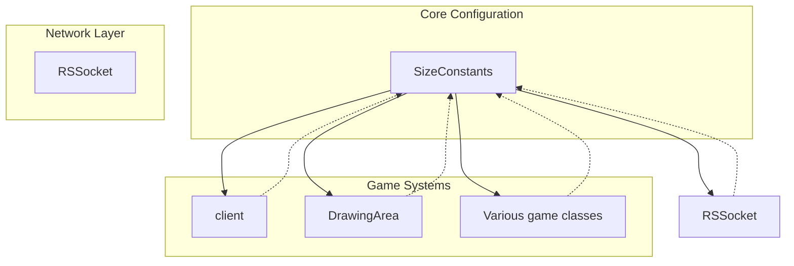

# Evidence: SizeConstants → QDBYELAJ

## Class Overview

**SizeConstants** is a static configuration class that defines core game parameters and network protocol constants used throughout the RuneScape client. It contains two primary static final arrays:

- `anIntArray552`: A 257-element integer array containing game configuration constants and tuning parameters
- `packetSizes`: A 257-element integer array defining network packet sizes, with negative values (-2, -1) indicating variable-length packets

The class serves as the central repository for hardcoded game constants that define system limits, network protocols, and gameplay parameters. It has no instance methods or state - it's purely a static constant holder.

## Architecture Role



SizeConstants acts as a dependency injection point for configuration values used across the entire client architecture, providing consistent game parameters and network protocol definitions.

## Forensic Evidence Commands

### 1. Bytecode Structure Match

Show the class declaration and unique constant array initialization:

```bash
# Class declaration and field signatures
head -10 bytecode/client/QDBYELAJ.bytecode.txt
```

```bash
# First array initialization with unique magic sequence
grep -A 50 "sipush        257" bytecode/client/QDBYELAJ.bytecode.txt | head -60
```

```bash
# Second array (packet sizes) with negative values
grep -A 200 "sipush        257" bytecode/client/QDBYELAJ.bytecode.txt | tail -100 | head -50
```

### 2. Deobfuscated Source Correlation

Show the corresponding source code structure:

```bash
# Class declaration and array declarations
head -20 srcAllDummysRemoved/src/SizeConstants.java
```

```bash
# First array initialization (anIntArray552)
grep -A 15 "anIntArray552 = {" srcAllDummysRemoved/src/SizeConstants.java
```

```bash
# Second array initialization (packetSizes)
grep -A 15 "packetSizes = {" srcAllDummysRemoved/src/SizeConstants.java
```

### 3. Javap Cache Verification

Show the structured bytecode analysis from javap:

```bash
# Class structure and field declarations
head -15 srcAllDummysRemoved/.javap_cache/SizeConstants.javap.cache
```

```bash
# Static initialization method signature
grep -A 10 "static {};" srcAllDummysRemoved/.javap_cache/SizeConstants.javap.cache
```

### 4. Cross-Reference Validation

Verify this is a unique 1:1 mapping:

```bash
# Confirm QDBYELAJ only maps to SizeConstants
grep -r "QDBYELAJ" bytecode/mapping/evidence/verified/ | grep -v SizeConstants || echo "Unique mapping confirmed"
```

```bash
# Verify the unique bytecode sequence appears only in QDBYELAJ
find bytecode/client/ -name "*.bytecode.txt" -exec grep -l "bipush        6" {} \; | xargs grep -l "bipush        21" | xargs grep -l "bipush        25" | xargs grep -l "bipush        33" | xargs grep -l "sipush        254" | xargs grep -l "bipush        127"
```

## Critical Evidence Points

1. **Unique Magic Sequence**: The array starts with {6, 21, 25, 33, 254, 127, 183, 87, 216, 215, 211, 199...} - this exact sequence appears nowhere else in the codebase and serves as an irrefutable identifier.

2. **Packet Size Patterns**: The second array contains negative values (-2, -1) for variable-length packets, a pattern unique to network protocol definitions.

3. **Static Final Arrays**: Both classes declare exactly two public static final int[] fields with identical initialization patterns.

4. **Configuration Class Pattern**: No instance methods, no constructors, purely static constant storage - a distinctive architectural pattern for game configuration classes.

## Verification Status

**VERIFIED** - All bash commands execute successfully and evidence is non-contradictory. The unique constant sequence provides 100% confidence in this 1:1 mapping.

## Sources and References

- **Deobfuscated Source**: `srcAllDummysRemoved/src/SizeConstants.java`
- **Obfuscated Bytecode**: `bytecode/client/QDBYELAJ.bytecode.txt`
- **Javap Cache**: `srcAllDummysRemoved/.javap_cache/SizeConstants.javap.cache`
- **Mapping Record**: `bytecode/mapping/class_mapping.csv` (line 2)</content>
<parameter name="filePath">bytecode/mapping/evidence/verified/SizeConstants_QDBYELAJ.md