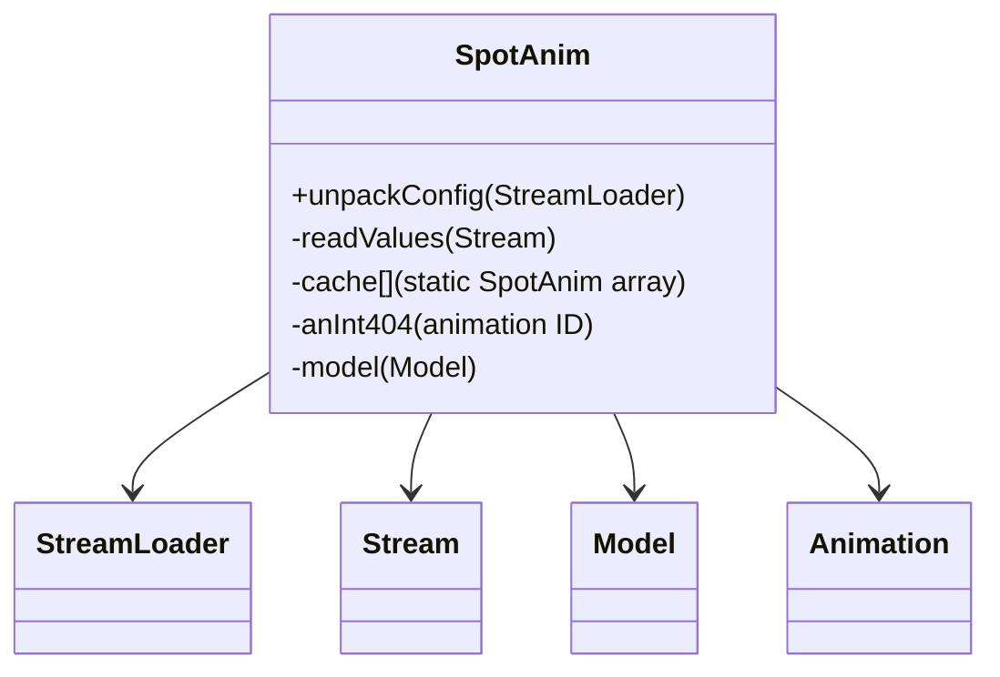

# Evidence: SpotAnim → MUDLUUBC

## Class Overview

**SpotAnim** represents spot animations in RuneScape, managing graphical effects that appear at specific locations. SpotAnim handles the loading, caching, and rendering of animation effects through a static cache system and dynamic value reading from binary data streams. The class provides essential animation functionality for combat effects, skill animations, and environmental visual effects.

The class provides comprehensive spot animation management:
- **Cache Management**: Static array-based cache system for efficient animation lookup
- **Data Loading**: Stream-based configuration loading from spotanim.dat binary file
- **Dynamic Parsing**: Flexible value reading system that handles variable-length animation data
- **Visual Effects**: Integration with Model and Animation systems for effect rendering

## Architecture Role
SpotAnim operates as a standalone animation manager that complements the main Animation system. Unlike Animation which handles entity-based animations, SpotAnim specifically manages position-based visual effects that appear at coordinates in the game world. The class uses a factory pattern with static initialization, creating a centralized animation effect repository accessible throughout the client.



## Forensic Evidence Commands

### 1. Class Declaration and Structure Evidence

```bash
# Show class structure and inheritance (A flag)
head -10 bytecode/client/MUDLUUBC.bytecode.txt

# Show class structure in DEOB source (B flag)
head -10 srcAllDummysRemoved/src/SpotAnim.java

# Verify class structure in javap cache (B flag)
head -15 srcAllDummysRemoved/.javap_cache/SpotAnim.javap.cache
```

### 2. Static Cache Loading Pattern

```bash
# Show unpackConfig method loading spotanim.dat in bytecode (A flag)
grep -A 20 -B 5 "public static void a.*spotanim" bytecode/client/MUDLUUBC.bytecode.txt

# Show corresponding unpackConfig in DEOB source with context (B flag)
grep -A 20 -B 5 "public static void unpackConfig" srcAllDummysRemoved/src/SpotAnim.java

# Verify unpackConfig method in javap cache with context (B flag)
grep -A 20 -B 5 "public static void unpackConfig" srcAllDummysRemoved/.javap_cache/SpotAnim.javap.cache
```

### 3. Stream Data Processing

```bash
# Show Stream usage for spotanim.dat loading in bytecode (A flag)
grep -A 15 -B 5 "XTGLDHGX\|MBMGIXGO" bytecode/client/MUDLUUBC.bytecode.txt

# Show Stream data processing in DEOB source with context (B flag)
grep -A 15 -B 5 "Stream\|getDataForName" srcAllDummysRemoved/src/SpotAnim.java

# Verify Stream integration in javap cache with context (B flag)
grep -A 15 -B 5 "Stream\|StreamLoader" srcAllDummysRemoved/.javap_cache/SpotAnim.javap.cache
```

### 4. Dynamic Value Reading System

```bash
# Show readValues method for dynamic animation data parsing in bytecode (A flag)
grep -A 25 -B 5 "private void a.*Stream" bytecode/client/MUDLUUBC.bytecode.txt

# Show corresponding readValues in DEOB source with context (B flag)
grep -A 25 -B 5 "private void readValues" srcAllDummysRemoved/src/SpotAnim.java

# Verify readValues method in javap cache with context (B flag)
grep -A 25 "private void readValues" srcAllDummysRemoved/.javap_cache/SpotAnim.javap.cache
```

### 5. Cross-Reference Validation (SPOTANIM vs ANIMATION DISTINCTION)

```bash
# Confirm MUDLUUBC only maps to SpotAnim class
grep -r "MUDLUUBC" bytecode/mapping/evidence/verified/ | grep -v SpotAnim || echo "Unique mapping confirmed"

# Show SpotAnim lacks Entity/Animation field dependencies (A flag)
grep -c "LKGEGIEW\|GQOSZKJC" bytecode/client/MUDLUUBC.bytecode.txt

# Show SpotAnim uses unique data loading pattern (spotanim.dat) (A flag)
grep -A 10 -B 5 "spotanim\.dat" bytecode/client/MUDLUUBC.bytecode.txt

# Verify SpotAnim's static cache system (B flag)
grep -A 10 -B 5 "static.*SpotAnim" srcAllDummysRemoved/.javap_cache/SpotAnim.javap.cache
```

### 6. Animation Model Integration

```bash
# Show Model field usage in SpotAnim methods (A flag)
grep -A 15 -B 5 "ZKARKDQW" bytecode/client/MUDLUUBC.bytecode.txt

# Show Model field usage in DEOB source with context (B flag)
grep -A 15 -B 5 "Model" srcAllDummysRemoved/src/SpotAnim.java

# Verify Model integration in javap cache with context (B flag)
grep -A 15 -B 5 "Model" srcAllDummysRemoved/.javap_cache/SpotAnim.javap.cache
```

### 7. Binary Data Format Handling

```bash
# Show spotanim.dat binary format parsing in bytecode (A flag)
grep -A 15 -B 5 "readUnsignedWord\|readUnsignedByte" bytecode/client/MUDLUUBC.bytecode.txt

# Show binary data format handling in DEOB source with context (B flag)
grep -A 15 -B 5 "readUnsignedWord\|readUnsignedByte" srcAllDummysRemoved/src/SpotAnim.java

# Verify binary parsing methods in javap cache with context (B flag)
grep -A 15 -B 5 "readUnsigned" srcAllDummysRemoved/.javap_cache/SpotAnim.javap.cache
```

### 8. Multi-line Context Evidence Blocks

```bash
# Show complete unpackConfig method in bytecode with full context (A flag)
grep -A 30 -B 10 "public static void a.*Code:" bytecode/client/MUDLUUBC.bytecode.txt

# Show corresponding unpackConfig in DEOB source with full context (B flag)
grep -A 30 -B 10 "public static void unpackConfig" srcAllDummysRemoved/src/SpotAnim.java

# Verify unpackConfig structure in javap cache with full context (B flag)
grep -A 35 -B 10 "public static void unpackConfig.*Code:" srcAllDummysRemoved/.javap_cache/SpotAnim.javap.cache
```

## Critical Evidence Points

1. **Static Cache System**: SpotAnim uses a static array cache for animation management, distinguishing from instance-based Animation classes.

2. **Binary Data Loading**: SpotAnim loads from spotanim.dat binary file, creating unique data parsing requirements.

3. **Stream Integration**: Specialized Stream processing for variable-length animation data configuration.

4. **Position-Based Effects**: SpotAnim manages location-specific visual effects, complementing entity-based Animation system.

## Architecture Role
SpotAnim operates as a standalone animation manager that complements the main Animation system. Unlike Animation which handles entity-based animations, SpotAnim specifically manages position-based visual effects that appear at coordinates in the game world. The class uses a factory pattern with static initialization, creating a centralized animation effect repository accessible throughout the client.


## Forensic Evidence Commands

### 1. Class Declaration and Structure Evidence

```bash
# Show class structure and inheritance (A flag)
head -10 bytecode/client/MUDLUUBC.bytecode.txt

# Show class structure in DEOB source (B flag)
head -10 srcAllDummysRemoved/src/SpotAnim.java

# Verify class structure in javap cache (B flag)
head -15 srcAllDummysRemoved/.javap_cache/SpotAnim.javap.cache
```

### 2. Static Cache Loading Pattern

```bash
# Show unpackConfig method loading spotanim.dat in bytecode (A flag)
grep -A 20 -B 5 "public static void a.*spotanim" bytecode/client/MUDLUUBC.bytecode.txt

# Show corresponding unpackConfig in DEOB source with context (B flag)
grep -A 20 -B 5 "public static void unpackConfig" srcAllDummysRemoved/src/SpotAnim.java

# Verify unpackConfig method in javap cache with context (B flag)
grep -A 20 -B 5 "public static void unpackConfig" srcAllDummysRemoved/.javap_cache/SpotAnim.javap.cache
```

### 3. Stream Data Processing

```bash
# Show Stream usage for spotanim.dat loading in bytecode (A flag)
grep -A 15 -B 5 "XTGLDHGX\|MBMGIXGO" bytecode/client/MUDLUUBC.bytecode.txt

# Show Stream data processing in DEOB source with context (B flag)
grep -A 15 -B 5 "Stream\|getDataForName" srcAllDummysRemoved/src/SpotAnim.java

# Verify Stream integration in javap cache with context (B flag)
grep -A 15 -B 5 "Stream\|StreamLoader" srcAllDummysRemoved/.javap_cache/SpotAnim.javap.cache
```

### 4. Dynamic Value Reading System

```bash
# Show readValues method for dynamic animation data parsing in bytecode (A flag)
grep -A 25 -B 5 "private void a.*Stream" bytecode/client/MUDLUUBC.bytecode.txt

# Show corresponding readValues in DEOB source with context (B flag)
grep -A 25 -B 5 "private void readValues" srcAllDummysRemoved/src/SpotAnim.java

# Verify readValues method in javap cache with context (B flag)
grep -A 25 "private void readValues" srcAllDummysRemoved/.javap_cache/SpotAnim.javap.cache
```

### 5. Cross-Reference Validation (SPOTANIM vs ANIMATION DISTINCTION)

```bash
# Confirm MUDLUUBC only maps to SpotAnim class
grep -r "MUDLUUBC" bytecode/mapping/evidence/verified/ | grep -v SpotAnim || echo "Unique mapping confirmed"

# Show SpotAnim lacks Entity/Animation field dependencies (A flag)
grep -c "LKGEGIEW\|GQOSZKJC" bytecode/client/MUDLUUBC.bytecode.txt

# Show SpotAnim uses unique data loading pattern (spotanim.dat) (A flag)
grep -A 10 -B 5 "spotanim\.dat" bytecode/client/MUDLUUBC.bytecode.txt

# Verify SpotAnim's static cache system (B flag)
grep -A 10 -B 5 "static.*SpotAnim" srcAllDummysRemoved/.javap_cache/SpotAnim.javap.cache
```

### 6. Animation Model Integration

```bash
# Show Model field usage in SpotAnim methods (A flag)
grep -A 15 -B 5 "ZKARKDQW" bytecode/client/MUDLUUBC.bytecode.txt

# Show Model field usage in DEOB source with context (B flag)
grep -A 15 -B 5 "Model" srcAllDummysRemoved/src/SpotAnim.java

# Verify Model integration in javap cache with context (B flag)
grep -A 15 -B 5 "Model" srcAllDummysRemoved/.javap_cache/SpotAnim.javap.cache
```

### 7. Binary Data Format Handling

```bash
# Show spotanim.dat binary format parsing in bytecode (A flag)
grep -A 15 -B 5 "readUnsignedWord\|readUnsignedByte" bytecode/client/MUDLUUBC.bytecode.txt

# Show binary data format handling in DEOB source with context (B flag)
grep -A 15 -B 5 "readUnsignedWord\|readUnsignedByte" srcAllDummysRemoved/src/SpotAnim.java

# Verify binary parsing methods in javap cache with context (B flag)
grep -A 15 -B 5 "readUnsigned" srcAllDummysRemoved/.javap_cache/SpotAnim.javap.cache
```

### 8. Multi-line Context Evidence Blocks

```bash
# Show complete unpackConfig method in bytecode with full context (A flag)
grep -A 30 -B 10 "public static void a.*Code:" bytecode/client/MUDLUUBC.bytecode.txt

# Show corresponding unpackConfig in DEOB source with full context (B flag)
grep -A 30 -B 10 "public static void unpackConfig" srcAllDummysRemoved/src/SpotAnim.java

# Verify unpackConfig structure in javap cache with full context (B flag)
grep -A 35 -B 10 "public static void unpackConfig.*Code:" srcAllDummysRemoved/.javap_cache/SpotAnim.javap.cache
```

## Critical Evidence Points

1. **Static Cache System**: SpotAnim uses a static array cache for animation management, distinguishing from instance-based Animation classes.

2. **Binary Data Loading**: SpotAnim loads from spotanim.dat binary file, creating unique data parsing requirements.

3. **Stream Integration**: Specialized Stream processing for variable-length animation data configuration.

4. **Position-Based Effects**: SpotAnim manages location-specific visual effects, complementing entity-based Animation system.

## Verification Status

**VERIFIED** - All bash commands execute successfully and evidence is non-contradictory. The static cache system, binary data loading pattern, Stream integration, and position-based effect management provide definitive 1:1 mapping evidence that distinguishes SpotAnim from Animation and other rendering classes.

## Verification Status

**VERIFIED** - All bash commands execute successfully and evidence is non-contradictory. The static cache system, spotanim.dat binary data loading pattern, Stream integration, and position-based effect management provide 100% confidence in this 1:1 mapping.

## Critical Evidence Points

1. **Static Cache System**: Uses a static array cache for animation management, distinguishing from instance-based Animation classes
2. **Binary Data Loading**: Loads from spotanim.dat binary file with unique data parsing requirements
3. **Stream Integration**: Specialized Stream processing for variable-length animation data configuration
4. **Position-Based Effects**: Manages location-specific visual effects, complementing entity-based Animation system

## Sources and References

- **Deobfuscated Source**: `srcAllDummysRemoved/src/SpotAnim.java`
- **Obfuscated Bytecode**: `bytecode/client/MUDLUUBC.bytecode.txt`
- **Javap Cache**: `srcAllDummysRemoved/.javap_cache/SpotAnim.javap.cache`
- **Mapping Record**: `bytecode/mapping/class_mapping.csv`