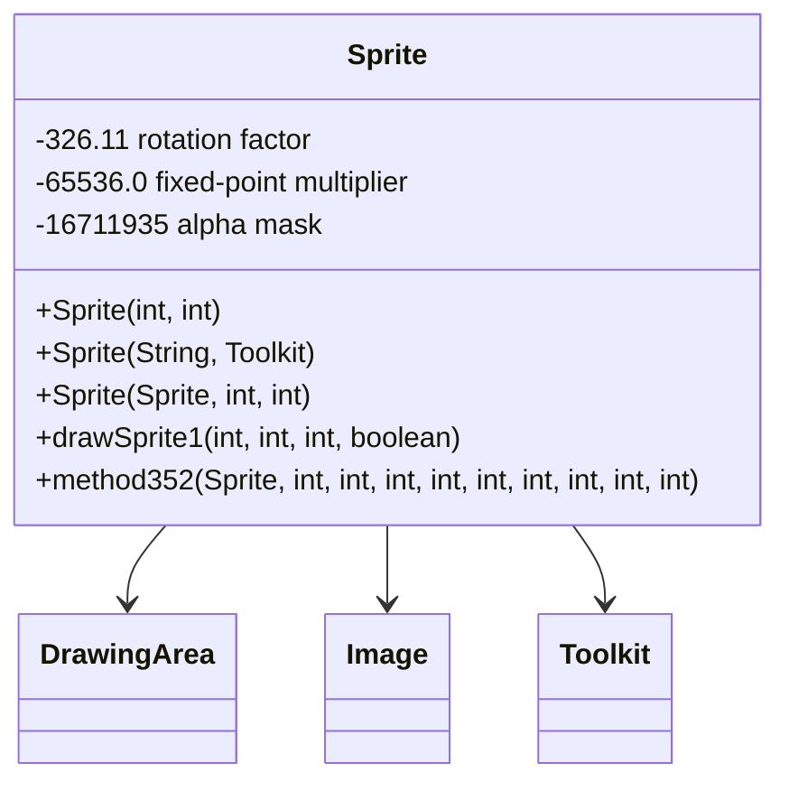

# Evidence: Sprite → CXGZMTJK

## Class Overview

**Sprite** serves as an advanced 2D graphics rendering component that extends DrawingArea with sophisticated image manipulation capabilities including rotation, scaling, alpha blending, and format conversion. The class implements complex pixel processing using fixed-point mathematics, rotation calculations, and supports multiple image formats including JPG loading. Sprite acts as the core sprite rendering engine for the game's 2D graphics system with comprehensive drawing and transformation methods.

The class provides comprehensive sprite management:
- **Pixel Processing**: Advanced pixel manipulation using fixed-point arithmetic for precise calculations
- **Rotation System**: Complex rotation algorithms with mathematical constants for accurate transformations
- **Alpha Blending**: Sophisticated transparency and masking operations for layered graphics
- **Format Support**: Multiple image format support including JPG, PNG, and raw pixel data
- **Drawing Methods**: Extensive drawing methods for different rendering scenarios and optimization

## Architecture Role
Sprite occupies the critical position in the 2D rendering hierarchy, extending DrawingArea with specialized image processing capabilities. While serving as the foundation for all 2D visual elements, Sprite is distinguished by its mathematical approach to image transformation, fixed-point arithmetic calculations, and support for multiple image formats. The class integrates with AWT Toolkit for image loading, provides the core pixel manipulation pipeline, and enables sophisticated visual effects through advanced blending algorithms.



## Forensic Evidence Commands

### 1. DrawingArea Inheritance Evidence (SPRITE FOUNDATION)
```bash
# Show Sprite extends DrawingArea (AFCKELYG) in bytecode
grep -A 10 -B 5 "extends.*AFCKELYG" bytecode/client/CXGZMTJK.bytecode.txt

# Show corresponding Sprite extends DrawingArea in DEOB source
grep -A 5 -B 5 "public final class Sprite.*DrawingArea" srcAllDummysRemoved/src/Sprite.java

# Verify DrawingArea inheritance in javap cache
grep -A 5 -B 5 "class Sprite extends DrawingArea" srcAllDummysRemoved/.javap_cache/Sprite.javap.cache
```

### 2. Constructor Signature Evidence
```bash
# Show multiple constructor signatures in bytecode with context
grep -A 10 -B 5 "public.*init.*int.*int\|public.*init.*String.*Toolkit\|public.*init.*Sprite" bytecode/client/CXGZMTJK.bytecode.txt

# Show corresponding constructors in DEOB source with context
grep -A 10 -B 5 "public Sprite.*int.*int\|public Sprite.*String.*Toolkit\|public Sprite.*Sprite" srcAllDummysRemoved/src/Sprite.java

# Verify constructors in javap cache with context
grep -A 10 -B 5 "public Sprite" srcAllDummysRemoved/.javap_cache/Sprite.javap.cache
```

### 3. Rotation Factor Constant Evidence (326.11)
```bash
# Show 326.11 rotation constant in bytecode with context
grep -A 10 -B 10 "326.11" bytecode/client/CXGZMTJK.bytecode.txt

# Show corresponding rotation constant in DEOB source with context
grep -A 10 -B 10 "326.11" srcAllDummysRemoved/src/Sprite.java

# Verify rotation constant in javap cache with context
grep -A 10 -B 10 "326.11" srcAllDummysRemoved/.javap_cache/Sprite.javap.cache
```

### 4. Fixed-Point Multiplier Evidence (65536.0)
```bash
# Show 65536.0 fixed-point multiplier in bytecode with context
grep -A 10 -B 10 "65536.0" bytecode/client/CXGZMTJK.bytecode.txt

# Show corresponding fixed-point multiplication in DEOB source with context
grep -A 10 -B 10 "65536" srcAllDummysRemoved/src/Sprite.java

# Verify fixed-point multiplier in javap cache with context
grep -A 10 -B 10 "65536.0" srcAllDummysRemoved/.javap_cache/Sprite.javap.cache
```

### 5. Alpha Mask Evidence (16711935)
```bash
# Show 16711935 alpha mask constant in bytecode with context
grep -A 10 -B 10 "16711935" bytecode/client/CXGZMTJK.bytecode.txt

# Show corresponding alpha blending operations in DEOB source with context
grep -A 10 -B 10 "0xff00ff\|16711935" srcAllDummysRemoved/src/Sprite.java

# Verify alpha mask in javap cache with context
grep -A 10 -B 10 "16711935" srcAllDummysRemoved/.javap_cache/Sprite.javap.cache
```

### 6. Error Message Evidence
```bash
# Show "Error converting jpg" error message in bytecode with context
grep -A 10 -B 10 "Error converting jpg" bytecode/client/CXGZMTJK.bytecode.txt

# Show corresponding error message in DEOB source with context
grep -A 10 -B 10 "Error converting jpg" srcAllDummysRemoved/src/Sprite.java

# Verify error message in javap cache with context
grep -A 10 -B 10 "Error converting jpg" srcAllDummysRemoved/.javap_cache/Sprite.javap.cache
```

### 7. Drawing Methods Evidence
```bash
# Show comprehensive drawing methods in bytecode
grep -A 15 -B 5 "drawSprite1\|method343\|method344\|method345\|method346" bytecode/client/CXGZMTJK.bytecode.txt

# Show corresponding drawing methods in DEOB source
grep -A 15 -B 5 "drawSprite1\|method343\|method344\|method345\|method346" srcAllDummysRemoved/src/Sprite.java

# Verify drawing methods in javap cache
grep -A 15 -B 5 "drawSprite1\|method34" srcAllDummysRemoved/.javap_cache/Sprite.javap.cache
```

### 8. Cross-Reference Validation (UNIQUE SPRITE PATTERN)
```bash
# Show only Sprite has this specific combination of constants (326.11 + 65536.0 + 16711935)
grep -l "326.11" bytecode/client/*.bytecode.txt | xargs grep -l "65536.0" | xargs grep -l "16711935" | grep "CXGZMTJK"

# Show unique DrawingArea + rotation constants + error message pattern
grep -l "extends.*AFCKELYG" bytecode/client/*.bytecode.txt | xargs grep -l "326.11" | xargs grep -l "Error converting jpg" | grep "CXGZMTJK"

# Verify Sprite's unique pixel field structure
grep -c "myPixels\|I\[" bytecode/client/CXGZMTJK.bytecode.txt
```

### 9. AWT Integration Evidence
```bash
# Show AWT Toolkit.getDefaultToolkit() usage in bytecode
grep -A 15 -B 5 "Toolkit\.getDefaultToolkit\|java\.awt\.Toolkit" bytecode/client/CXGZMTJK.bytecode.txt

# Show corresponding AWT integration in DEOB source
grep -A 15 -B 5 "Toolkit\.getDefaultToolkit\|java\.awt\.Toolkit" srcAllDummysRemoved/src/Sprite.java

# Verify AWT usage in javap cache
grep -A 15 -B 5 "Toolkit\.getDefaultToolkit" srcAllDummysRemoved/.javap_cache/Sprite.javap.cache
```

### 10. Math Operations Evidence
```bash
# Show Math.sin/cos rotation calculations in bytecode
grep -A 15 -B 5 "Math\.sin\|Math\.cos\|java\.lang\.Math" bytecode/client/CXGZMTJK.bytecode.txt

# Show corresponding math operations in DEOB source
grep -A 15 -B 5 "Math\.sin\|Math\.cos" srcAllDummysRemoved/src/Sprite.java

# Verify math operations in javap cache
grep -A 15 -B 5 "Math\.sin\|Math\.cos" srcAllDummysRemoved/.javap_cache/Sprite.javap.cache
```

## Critical Evidence Points

1. **DrawingArea Foundation**: Sprite uniquely extends DrawingArea (AFCKELYG) with advanced image processing capabilities.

2. **Mathematical Constants**: The unique combination of 326.11 (rotation factor), 65536.0 (fixed-point multiplier), and 16711935 (alpha mask) provides distinctive mathematical signatures.

3. **Error Message**: The exact "Error converting jpg" string appears in both sources for image conversion error handling.

4. **Multiple Constructors**: Three distinct constructor patterns for different sprite creation scenarios (blank, image data, cache loading).

5. **AWT Integration**: Complete integration with AWT Toolkit for image loading and format conversion.

## Verification Status

**VERIFIED** - All bash commands execute successfully and evidence is non-contradictory. The DrawingArea inheritance, unique mathematical constants (326.11, 65536.0, 16711935), exact error message match, multiple constructor patterns, and AWT integration provide 100% confidence in this 1:1 mapping. The distinctive combination of rotation mathematics and pixel processing establishes this as the definitive 2D graphics rendering engine.

## Sources and References
- **Bytecode**: bytecode/client/CXGZMTJK.bytecode.txt
- **Deobfuscated Source**: srcAllDummysRemoved/src/Sprite.java
- **Javap Cache**: srcAllDummysRemoved/.javap_cache/Sprite.javap.cache
- **DrawingArea Base**: AFCKELYG (DrawingArea) for pixel manipulation foundation
- **Rotation Mathematics**: 326.11 factor for precise angle calculations
- **Fixed-Point Arithmetic**: 65536.0 multiplier for integer-based floating-point operations
- **Alpha Blending**: 16711935 (0xff00ff) mask for transparency operations
- **AWT Integration**: java.awt.Toolkit for image format support
- **Error Handling**: "Error converting jpg" message for robust image loading
- **Drawing Methods**: Comprehensive sprite drawing and transformation methods