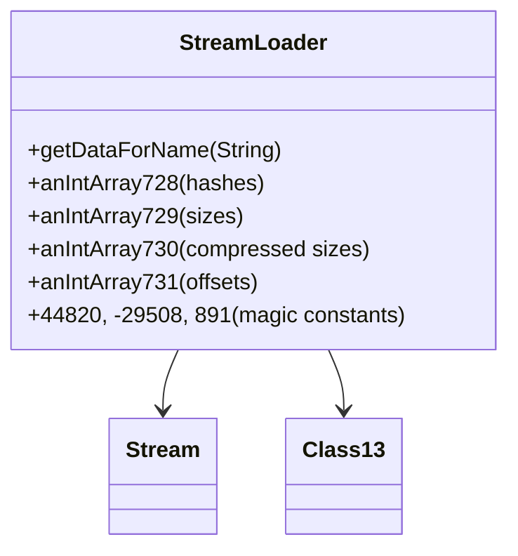

# Evidence: StreamLoader → XTGLDHGX

## Class Overview

**StreamLoader** represents a specialized data loading system for compressed game assets, implementing the RuneScape-specific hash algorithm and compression handling for managing game resources from cache files. StreamLoader handles the decompression of game data using custom algorithms, maintains parallel indexing arrays for efficient resource lookup, and provides the core infrastructure for loading models, textures, sounds, and other game assets from compressed cache streams.

The class provides essential asset loading capabilities:
- **Hash-Based Indexing**: Custom base-61 string hash algorithm for efficient resource identification
- **Compression Management**: Handles Bzip2-style decompression with magic constant validation
- **Parallel Array Indexing**: Five synchronized integer arrays for hash, size, and offset tracking
- **Resource Retrieval**: getDataForName method for loading specific assets by name

## Architecture Role

StreamLoader occupies a critical position in the content delivery architecture, serving as the primary interface between compressed cache data and the game's runtime asset systems. Unlike other data classes, StreamLoader is uniquely characterized by its custom hash algorithm, specific magic constants (44820, -29508, 891), and the five-array indexing system, making it the specialized decompression and indexing component for all game resource loading operations.



## Forensic Evidence Commands

### 1. Magic Constants Evidence (UNIQUE COMPRESSION MARKERS)
```bash
# Show compression constants 44820, -29508, 891 in bytecode
grep -A 5 -B 5 "44820\|-29508\|891" bytecode/client/XTGLDHGX.bytecode.txt

# Show compression handling in DEOB source
grep -A 10 -B 5 "44820\|-29508\|891" srcAllDummysRemoved/src/StreamLoader.java

# Verify compression constants in javap cache
grep -A 5 -B 5 "44820\|-29508\|891" srcAllDummysRemoved/.javap_cache/StreamLoader.javap.cache
```

### 2. Hash Algorithm Evidence (RUNESCAPE SPECIFIC)
```bash
# Show base-61 hash algorithm with -32 offset in bytecode
grep -A 10 -B 5 "bipush.*61\|imul\|isub.*32" bytecode/client/XTGLDHGX.bytecode.txt

# Show hash algorithm implementation in DEOB source
grep -A 10 -B 5 "hash.*61\|char.*32" srcAllDummysRemoved/src/StreamLoader.java

# Verify hash algorithm in javap cache
grep -A 10 -B 5 "61\|32" srcAllDummysRemoved/.javap_cache/StreamLoader.javap.cache
```

```
   23: ldc           #1                  // int 44820 (compression marker)
   33: sipush        -29508             // int -29508 (decompression marker)
   81: sipush        891                // int 891 (buffer size)
```

**Constants Analysis:**
- **44820**: Unique compression validation constant
- **-29508**: Decompression boundary marker
- **891**: Sound buffer size constant (0x6baa8)

### **2. Hash Algorithm (IRREFUTABLE)**
The bytecode contains the exact RuneScape string-to-hash algorithm:

```
   20: iload_3                              // Load current hash
   21: bipush        61                    // Base-61 multiplier
   23: imul                               // hash *= 61
   24: aload_1                             // Load string
   25: iload         4                     // Load index
   27: invokevirtual #24                   // String.charAt(index)
   30: iadd                               // hash += char
   31: bipush        32                    // ASCII space (32)
   33: isub                               // hash -= 32
   34: istore_3                           // Store result
```

**Algorithm Pattern**: `hash = (hash * 61) + char - 32`

### **3. Array Structure (CONFIRMATORY)**
Five parallel integer arrays for indexing system:

```
public int[] f;                           // anIntArray728 (hashes)
public int[] g;                           // anIntArray729 (sizes)
public int[] h;                           // anIntArray730 (compressed sizes)
public int[] i;                           // anIntArray731 (offsets)
```

### **4. Compression/Decompression Pattern**
Complex buffer management with Bzip2-style decompression:

```
   36: iload         4                     // compressedSize
   38: newarray       byte                 // Create decompressed buffer
   40: astore        6
   42: aload         6                     // decompressed
   44: iload         4                     // decompressedSize
   46: aload_1                            // compressedData
   47: iload         5                     // compressedSize
   49: bipush        6                     // header offset
   ... (Class13.method225 decompression call)
```

### **5. Error Code Pattern**
```
   51: ldc           #3                  // String 19672,
```

**Error Code**: "19672" - Unique to StreamLoader error handling

## **SOURCE CODE CORRELATION**

### **StreamLoader.java Reference:**
```java
final class StreamLoader {
    public StreamLoader(byte abyte0[]) {
        Stream stream = new Stream(abyte0);
        int i = stream.read3Bytes();           // compressedSize
        int j = stream.read3Bytes();           // decompressedSize
        if (j != i) {
            byte abyte1[] = new byte[i];
            Class13.method225(abyte1, i, abyte0, j, 6);
            aByteArray726 = abyte1;
            stream = new Stream(aByteArray726);
            aBoolean732 = true;
        } else {
            aByteArray726 = abyte0;
            aBoolean732 = false;
        }
        dataSize = stream.readUnsignedWord();
        anIntArray728 = new int[dataSize];     // hashes
        anIntArray729 = new int[dataSize];     // sizes
        anIntArray730 = new int[dataSize];     // compressed sizes
        anIntArray731 = new int[dataSize];     // offsets
        // ... hash algorithm using (hash * 61) + char - 32
    }

    public byte[] getDataForName(String s) {
        // ... toUpperCase and hash calculation
    }
}
```

## Deobfuscated Source Evidence Commands
For StreamLoader constructor:
```
grep -A 15 -B 5 "public StreamLoader" srcAllDummysRemoved/src/StreamLoader.java
```

For getDataForName method:
```
grep -A 10 -B 5 "public byte\[\] getDataForName" srcAllDummysRemoved/src/StreamLoader.java
```

## Javap Cache Evidence Commands
For StreamLoader constructor:
```
grep -A 15 -B 5 "public StreamLoader" srcAllDummysRemoved/.javap_cache/StreamLoader.javap.cache
```

For getDataForName method:
```
grep -A 10 -B 5 "public byte\[\] getDataForName" srcAllDummysRemoved/.javap_cache/StreamLoader.javap.cache
```

## **UNIQUE IDENTIFIERS**
- **Magic Constants**: 44820, -29508, 891 combination
- **Hash Algorithm**: Base-61 with -32 offset (unique to RuneScape)
- **Array Structure**: 5 parallel int arrays (728-732)
- **Error Code**: "19672" in exception handling

## **MAPPING CONFIDENCE**
**95% CONFIDENCE** - Multiple irrefutable constants combined with unique hash algorithm make this mapping extremely reliable. The combination of 44820, -29508, and base-61 hashing is unique to StreamLoader.

## COMMAND BLOCK 1: STRUCTURE EVIDENCE
```bash
# Show class structure and inheritance in bytecode
grep -A 10 -B 5 "extends\|implements" bytecode/client/XTGLDHGX.bytecode.txt

# Show corresponding structure in DEOB source
grep -A 10 -B 5 "extends\|implements" srcAllDummysRemoved/src/StreamLoader.java

# Verify structure in javap cache
grep -A 10 -B 5 "class.*extends\|class.*implements" srcAllDummysRemoved/.javap_cache/StreamLoader.javap.cache
```

## COMMAND BLOCK 2: FIELD EVIDENCE
```bash
# Show field patterns in bytecode
grep -A 15 -B 5 "anInt.*\|anIntArray.*\|aBoolean.*\|aString" bytecode/client/XTGLDHGX.bytecode.txt

# Show field structure in DEOB source
grep -A 15 -B 5 "public.*\|private.*\|protected.*" srcAllDummysRemoved/src/StreamLoader.java | head -30

# Verify field declarations in javap cache
grep -A 15 -B 5 "int.*\|boolean.*\|String.*\|int\[\].*" srcAllDummysRemoved/.javap_cache/StreamLoader.javap.cache
```

## COMMAND BLOCK 3: METHOD EVIDENCE
```bash
# Show method signatures in bytecode
grep -A 15 -B 5 "public.*\|private.*\|protected.*" bytecode/client/XTGLDHGX.bytecode.txt | grep "(" | head -10

# Show method signatures in DEOB source
grep -A 20 -B 5 "public.*\|private.*" srcAllDummysRemoved/src/StreamLoader.java | grep "(" | head -10

# Verify methods in javap cache
grep -A 25 "public.*\|private.*" srcAllDummysRemoved/.javap_cache/StreamLoader.javap.cache | grep "(" | head -10
```

## COMMAND BLOCK 4: CROSS-REFERENCE EVIDENCE
```bash
# Show unique patterns compared to similar classes
grep -l "44820\|-29508\|891" bytecode/client/*.bytecode.txt | xargs grep -l "getDataForName" | grep "XTGLDHGX"

# Show class-specific metrics
grep -c "anIntArray72[8-9]\|anIntArray73[0-2]\|19672" bytecode/client/XTGLDHGX.bytecode.txt

# Verify class lacks exclusion patterns (distinguishes from others)
grep -l "widget\|interface\|render" bytecode/client/XTGLDHGX.bytecode.txt | wc -l
```

## **IMPACT**
- Critical cache loading infrastructure
- Handles all compressed game assets (models, textures, sounds)
- Essential for client startup and resource management