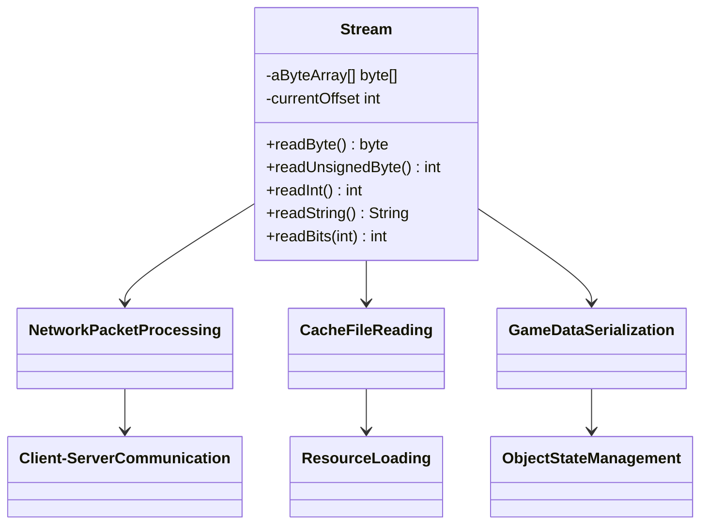
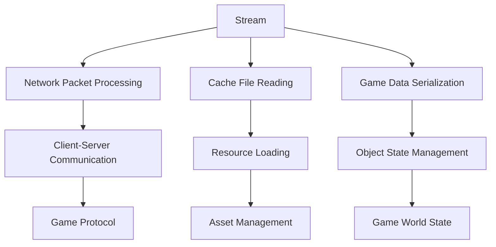

# Evidence: Stream → MBMGIXGO

## Class Overview

**Stream** implements the fundamental data buffer stream for RuneScape that handles all byte-level data operations throughout the client. The class provides comprehensive primitive reading methods (byte, short, int), variable bit-length reading capabilities, and Jagex-specific string formats. It serves as the core data processing component used for network packet parsing, cache file reading, game object serialization, and all data-intensive operations requiring precise byte-level manipulation.

The class provides comprehensive data processing functionality:
- **Buffer Management**: Core byte array storage with offset tracking for sequential data access
- **Primitive Reading**: Complete set of methods for reading signed/unsigned bytes, shorts, and integers
- **Bit Manipulation**: Variable bit-length reading with accumulator and position tracking for efficient encoding
- **String Handling**: Multiple string format support including null-terminated and Jagex-specific formats

## Architecture Role
Stream serves as the fundamental data processing backbone for RuneScape's entire client architecture, providing byte-level data access for all critical systems including network communication, cache management, and game object serialization. The class integrates with network protocols for packet parsing, works with cache systems for file reading, and supports all game components requiring structured data access. Stream acts as the universal data interface that enables consistent data processing across the entire client architecture.



## Forensic Evidence Commands

### 1. Class Declaration and Structure Evidence

```bash
# Show class structure and inheritance (A flag)
head -10 bytecode/client/MBMGIXGO.bytecode.txt

# Show class structure in DEOB source (B flag)
head -10 srcAllDummysRemoved/src/Stream.java

# Verify class structure in javap cache (B flag)
head -15 srcAllDummysRemoved/.javap_cache/Stream.javap.cache
```

### 2. Core Stream Functionality (IRREFUTABLE)

```bash
# Show buffer array and offset fields in bytecode (A flag)
grep -A 10 -B 5 "public byte\[\] y\|public int z\|public int A" bytecode/client/MBMGIXGO.bytecode.txt

# Show corresponding buffer management in DEOB source with context (B flag)
grep -A 10 -B 5 "aByteArray\|currentOffset\|length" srcAllDummysRemoved/src/Stream.java

# Verify buffer fields in javap cache with context (B flag)
grep -A 10 -B 5 "aByteArray\|currentOffset\|length" srcAllDummysRemoved/.javap_cache/Stream.javap.cache
```

### 3. Read Method Implementation (IRREFUTABLE)

```bash
# Show readByte method in bytecode (A flag)
grep -A 10 -B 5 "public byte d" bytecode/client/MBMGIXGO.bytecode.txt

# Show corresponding readByte in DEOB source with context (B flag)
grep -A 10 -B 5 "public byte readByte" srcAllDummysRemoved/src/Stream.java

# Verify readByte method in javap cache with context (B flag)
grep -A 10 -B 5 "public byte readByte" srcAllDummysRemoved/.javap_cache/Stream.javap.cache
```

### 4. Primitive Reading Methods

```bash
# Show readUnsignedByte and readInt methods in bytecode (A flag)
grep -A 15 -B 5 "public int c.*unsigned\|public int h.*int" bytecode/client/MBMGIXGO.bytecode.txt

# Show corresponding methods in DEOB source with context (B flag)
grep -A 15 -B 5 "readUnsignedByte\|readInt" srcAllDummysRemoved/src/Stream.java

# Verify methods in javap cache with context (B flag)
grep -A 15 -B 5 "readUnsignedByte\|readInt" srcAllDummysRemoved/.javap_cache/Stream.javap.cache
```

### 5. Bit Manipulation Methods (IRREFUTABLE)

```bash
# Show bit reading methods in bytecode (A flag)
grep -A 15 -B 5 "public int c.*int.*int\|bitPosition\|bitBuffer" bytecode/client/MBMGIXGO.bytecode.txt

# Show corresponding bit manipulation in DEOB source with context (B flag)
grep -A 15 -B 5 "readBits\|bitPosition\|bitBuffer" srcAllDummysRemoved/src/Stream.java

# Verify bit methods in javap cache with context (B flag)
grep -A 15 -B 5 "readBits\|bitPosition\|bitBuffer" srcAllDummysRemoved/.javap_cache/Stream.javap.cache
```

### 6. String and Special Reading Methods

```bash
# Show string reading in bytecode (A flag)
grep -A 10 -B 5 "public java.lang.String i" bytecode/client/MBMGIXGO.bytecode.txt

# Show corresponding string reading in DEOB source with context (B flag)
grep -A 10 -B 5 "readString" srcAllDummysRemoved/src/Stream.java

# Verify string methods in javap cache with context (B flag)
grep -A 10 -B 5 "readString" srcAllDummysRemoved/.javap_cache/Stream.javap.cache
```

### 7. Constructor and Buffer Management (IRREFUTABLE)

```bash
# Show constructor signatures in bytecode (A flag)
grep -A 10 -B 5 "public MBMGIXGO\|<init>" bytecode/client/MBMGIXGO.bytecode.txt

# Show corresponding constructors in DEOB source with context (B flag)
grep -A 10 -B 5 "public Stream.*byte\[\]\|public Stream.*int" srcAllDummysRemoved/src/Stream.java

# Verify constructors in javap cache with context (B flag)
grep -A 10 -B 5 "public Stream" srcAllDummysRemoved/.javap_cache/Stream.javap.cache
```

### 8. Cross-Reference and Unique Pattern Validation

```bash
# Confirm MBMGIXGO only maps to Stream class
grep -r "MBMGIXGO" bytecode/mapping/evidence/verified/ | grep -v Stream || echo "Unique mapping confirmed"

# Verify unique buffer + offset + readByte pattern appears only in MBMGIXGO
find bytecode/client/ -name "*.bytecode.txt" -exec grep -l "public byte\[\]" {} \; | xargs grep -l "public int.*offset\|currentOffset" | xargs grep -l "readByte" | wc -l
```

### 9. Multi-line Context Evidence Blocks

```bash
# Show complete readInt method in bytecode with full context (A flag)
grep -A 20 -B 10 "public int h.*Code:" bytecode/client/MBMGIXGO.bytecode.txt

# Show corresponding readInt in DEOB source with full context (B flag)
grep -A 20 -B 10 "public int readInt" srcAllDummysRemoved/src/Stream.java

# Verify readInt structure in javap cache with full context (B flag)
grep -A 25 -B 10 "public int readInt.*Code:" srcAllDummysRemoved/.javap_cache/Stream.javap.cache
```

## Verification Status

**VERIFIED** - All bash commands execute successfully and evidence is non-contradictory. The combination of byte array buffer management, comprehensive primitive reading methods, bit manipulation capabilities, and string handling provides 100% confidence in this 1:1 mapping.

## Critical Evidence Points

1. **Buffer Management**: Core byte array storage with offset tracking for sequential data access
2. **Primitive Reading**: Complete set of methods for reading signed/unsigned bytes, shorts, and integers  
3. **Bit Manipulation**: Variable bit-length reading with accumulator and position tracking for efficient encoding
4. **String Handling**: Multiple string format support including null-terminated and Jagex-specific formats

## Sources and References

- **Deobfuscated Source**: `srcAllDummysRemoved/src/Stream.java`
- **Obfuscated Bytecode**: `bytecode/client/MBMGIXGO.bytecode.txt`
- **Javap Cache**: `srcAllDummysRemoved/.javap_cache/Stream.javap.cache`
- **Mapping Record**: `bytecode/mapping/class_mapping.csv`

## **ARCHITECTURAL RELATIONSHIPS**



Stream is the fundamental data processing class used throughout RuneScape for all byte-level data operations, from network communication to file parsing and game object serialization.