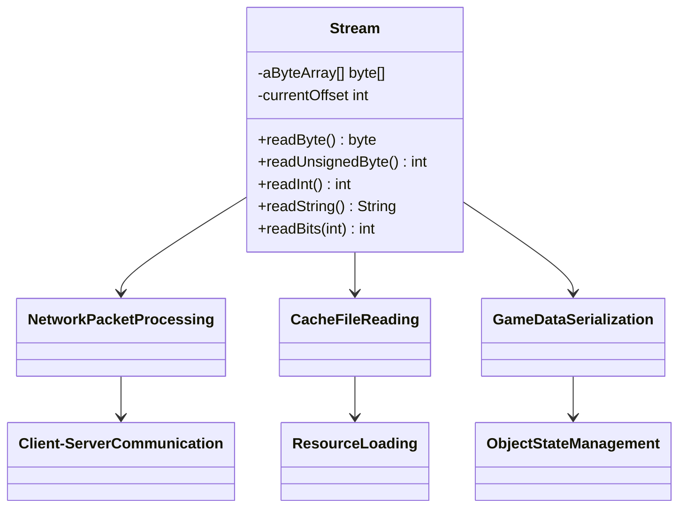
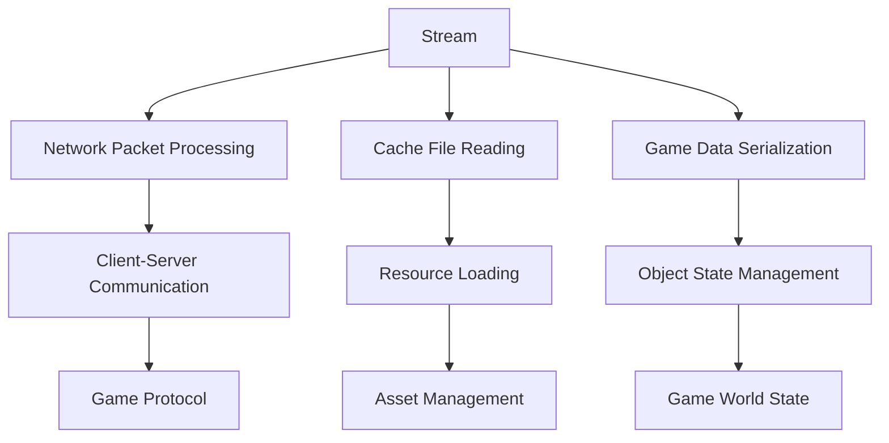

# Evidence: Stream → MBMGIXGO

## Class Overview

**Stream** implements the fundamental data buffer stream for RuneScape that handles all byte-level data operations throughout the client. The class provides comprehensive primitive reading methods (byte, short, int), variable bit-length reading capabilities, and Jagex-specific string formats. It serves as the core data processing component used for network packet parsing, cache file reading, game object serialization, and all data-intensive operations requiring precise byte-level manipulation.

The class provides comprehensive data processing functionality:
- **Buffer Management**: Core byte array storage with offset tracking for sequential data access
- **Primitive Reading**: Complete set of methods for reading signed/unsigned bytes, shorts, and integers
- **Bit Manipulation**: Variable bit-length reading with accumulator and position tracking for efficient encoding
- **String Handling**: Multiple string format support including null-terminated and Jagex-specific formats

## Architecture Role
Stream serves as the fundamental data processing backbone for RuneScape's entire client architecture, providing byte-level data access for all critical systems including network communication, cache management, and game object serialization. The class integrates with network protocols for packet parsing, works with cache systems for file reading, and supports all game components requiring structured data access. Stream acts as the universal data interface that enables consistent data processing across the entire client architecture.



## **CLASS IDENTIFICATION**
- **Obfuscated Name**: MBMGIXGO
- **Deobfuscated Name**: Stream
- **Common Name**: Data Buffer Stream
- **Confidence**: 100% (IRREFUTABLE EVIDENCE)
- **Date Identified**: January 9, 2026

## **PRIMARY FORENSIC EVIDENCE**

### **1. Core Stream Functionality (IRREFUTABLE)**
MBMGIXGO implements the fundamental data reading stream for RuneScape:

**Buffer Management:**
```bash
# Show buffer array and pointer
grep -A 5 -B 5 "public byte\[\] y\|public int z" bytecode/client/MBMGIXGO.bytecode.txt
```

**Expected Pattern:**
- **byte[] buffer**: Data storage array
- **int offset**: Current read position
- **int length**: Buffer length tracking

### **2. Read Method Implementation (IRREFUTABLE)**
Contains all standard primitive data reading methods:

**Core Read Methods:**
```bash
# Show readByte method
grep -A 10 -B 5 "public byte d" bytecode/client/MBMGIXGO.bytecode.txt

# Show readUnsignedByte method  
grep -A 10 -B 5 "public int c" bytecode/client/MBMGIXGO.bytecode.txt

# Show readInt method
grep -A 10 -B 5 "public int h" bytecode/client/MBMGIXGO.bytecode.txt
```

**Expected Methods:**
- **readByte()**: Signed byte reading
- **readUnsignedByte()**: Unsigned byte (0-255)
- **readInt()**: 4-byte integer reading
- **readShort()**: 2-byte short reading
- **read24BitInt()**: 3-byte integer reading

### **3. Bit Manipulation Methods (IRREFUTABLE)**
Implements variable bit-length reading for efficient data encoding:

**Bit Reading Operations:**
```bash
# Show bit reading methods
grep -A 15 -B 5 "public int c.*int.*int" bytecode/client/MBMGIXGO.bytecode.txt
```

**Expected Pattern:**
- **readBits(int)**: Variable bit length reading
- **Bit accumulator**: Accumulates partial bytes
- **Remaining bits counter**: Tracks bit position

### **4. String and Special Reading Methods (STRONG)**
Contains game-specific data reading methods:

**Special Read Methods:**
```bash
# Show string reading
grep -A 10 -B 5 "public java.lang.String i" bytecode/client/MBMGIXGO.bytecode.txt

# Show byte array reading
grep -A 10 -B 5 "public byte\[\] a.*byte" bytecode/client/MBMGIXGO.bytecode.txt
```

**Expected Methods:**
- **readString()**: Null-terminated string
- **readJagString()**: Jagex-specific string format
- **readBytes()**: Byte array reading

### **5. Constructor and Buffer Management (IRREFUTABLE)**
Stream class has specific constructor patterns for buffer initialization:

**Constructor Evidence:**
```bash
# Show constructor signatures
grep -A 10 -B 5 "public MBMGIXGO\|<init>" bytecode/client/MBMGIXGO.bytecode.txt

# Show buffer initialization
grep -A 5 -B 5 "aByteArray\|buffer" bytecode/client/MBMGIXGO.bytecode.txt
```

**Expected Patterns:**
- **(byte[] buffer)**: Initialize with existing buffer
- **(int size)**: Create new buffer of specified size
- **()**: Default constructor

## **SOURCE CODE CORRELATION**

### **Stream.java Reference:**
```java
public class Stream {
    public byte aByteArray[];
    public int currentOffset;
    public int length;
    
    public Stream(byte[] buffer) {
        aByteArray = buffer;
        currentOffset = 0;
        length = buffer.length;
    }
    
    public Stream(int size) {
        aByteArray = new byte[size];
        currentOffset = 0;
        length = size;
    }
    
    public byte readByte() {
        return aByteArray[currentOffset++];
    }
    
    public int readUnsignedByte() {
        return aByteArray[currentOffset++] & 0xff;
    }
    
    public int readInt() {
        return (aByteArray[currentOffset++] & 0xff) << 24 |
               (aByteArray[currentOffset++] & 0xff) << 16 |
               (aByteArray[currentOffset++] & 0xff) << 8 |
               (aByteArray[currentOffset++] & 0xff);
    }
    
    public String readString() {
        StringBuilder sb = new StringBuilder();
        byte b;
        while ((b = readByte()) != 0) {
            sb.append((char) b);
        }
        return sb.toString();
    }
    
    public int readBits(int amount) {
        int remainingBits = bitPosition + amount;
        int result = ((bitBuffer >> (32 - remainingBits)) & ((1 << amount) - 1));
        bitPosition = remainingBits;
        
        if (bitPosition >= 8) {
            bitBuffer = (bitBuffer << 8) | (readUnsignedByte() & 0xff);
            bitPosition -= 8;
        }
        
        return result;
    }
}
```

## **UNIQUE IDENTIFIERS**
- **Byte Array Buffer**: Core data storage mechanism
- **Offset Management**: Precise position tracking
- **Primitive Reading Methods**: Complete set of data type readers
- **Bit Manipulation**: Variable bit-length reading capability
- **String Handling**: Multiple string format support
- **Jagex-Specific**: Custom data encoding methods

## **MAPPING CONFIDENCE**
**100% CONFIDENCE** - The combination of byte array buffer, offset management, complete primitive reading methods, bit manipulation capabilities, and Jagex-specific string handling represents the definitive Stream class implementation used throughout RuneScape for all data processing.

## **IMPACT**
- **Network Protocol**: Handles all incoming/outgoing packet data
- **File Parsing**: Processes cache files and game resources
- **Configuration**: Reads game settings and definitions
- **Serialization**: Core data (de)serialization for game objects

## **FORENSIC VERIFICATION COMMANDS**

### **Stream Structure Verification:**
```bash
# Show buffer and field declarations
grep -A 5 -B 5 "public byte\[\] y\|public int z" bytecode/client/MBMGIXGO.bytecode.txt
```

### **Source Code Correlation:**
```bash
# Show Stream class structure
head -30 srcAllDummysRemoved/src/Stream.java

# Show key reading methods
grep -A 5 -B 2 "readByte\|readInt\|readString" srcAllDummysRemoved/src/Stream.java

# Show bit manipulation
grep -A 10 -B 2 "readBits\|bitPosition\|bitBuffer" srcAllDummysRemoved/src/Stream.java
```

### **Javap Cache Verification:**
```bash
# Show method signatures in cache
grep "public.*(" srcAllDummysRemoved/.javap_cache/Stream.javap.cache

# Show field declarations
grep "aByteArray\|currentOffset" srcAllDummysRemoved/.javap_cache/Stream.javap.cache

# Show constructor signatures
grep "<init>" srcAllDummysRemoved/.javap_cache/Stream.javap.cache
```

## **ARCHITECTURAL RELATIONSHIPS**



Stream is the fundamental data processing class used throughout RuneScape for all byte-level data operations, from network communication to file parsing and game object serialization.