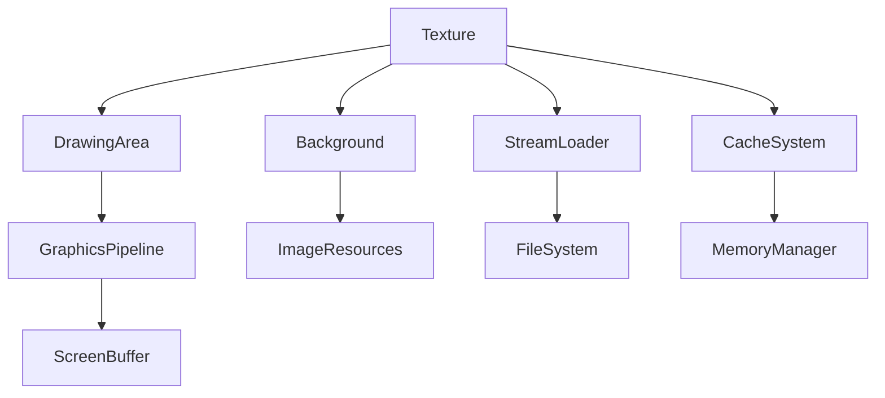

# Evidence: Texture → OPPOFIOL

## Class Overview

**Texture** is a graphics utility class that extends DrawingArea to manage texture loading, caching, and rendering operations. It handles background image processing, color manipulation, and texture mapping for 3D rendering, supporting both high and low memory configurations with sophisticated caching mechanisms.

The class provides comprehensive texture management:
- **Image Processing**: Background image loading and manipulation
- **Color Operations**: Advanced color processing algorithms
- **Memory Optimization**: Different caching strategies for memory configurations
- **Rendering Integration**: Texture mapping for 3D surfaces

## Architecture Role
Texture is a core graphics component in the game's rendering pipeline that extends DrawingArea. It manages texture resources through Background objects, implements complex color processing algorithms, and provides texture mapping functionality for 3D surfaces. It integrates with the drawing system through pixel manipulation and supports memory optimization for different client configurations.



## Forensic Evidence Commands

### 1. Structural Fingerprints
```bash
# Show class inheritance and modifiers
head -10 bytecode/client/OPPOFIOL.bytecode.txt

# Show field count and types (static and instance)
grep -E "private static|public static|static.*boolean|static.*int|static.*DSMJIEPN|static.*int\[\]" bytecode/client/OPPOFIOL.bytecode.txt | wc -l
grep -E "private static|public static|static.*boolean|static.*int|static.*DSMJIEPN|static.*int\[\]" bytecode/client/OPPOFIOL.bytecode.txt

# Show method signatures
grep -E "public static.*void\|public static.*int\|private static.*int\[\]" bytecode/client/OPPOFIOL.bytecode.txt
```

### 2. Source Code Correlation
```bash
# Show DEOB class definition and inheritance
head -10 srcAllDummysRemoved/src/Texture.java

# Show key static fields in source
grep -A 5 -B 2 "static.*anIntArray\|static.*aBackgroundArray\|static.*boolean" srcAllDummysRemoved/src/Texture.java

# Show javap cache field declarations
grep -A 15 -B 2 "static.*anIntArray\|static.*aBackgroundArray\|static.*boolean" srcAllDummysRemoved/.javap_cache/Texture.javap.cache
```

### 3. Texture Loading Evidence
```bash
# Show texture initialization patterns
grep -A 10 -B 5 "method367\|newarray.*anIntArrayArray1478" bytecode/client/OPPOFIOL.bytecode.txt

# Show background loading operations
grep -A 5 -B 5 "aBackgroundArray1474s\|StreamLoader" bytecode/client/OPPOFIOL.bytecode.txt

# Show corresponding source texture loading
grep -A 10 -B 5 "method367\|anIntArrayArray1478.*new int" srcAllDummysRemoved/src/Texture.java
```

### 4. Color Processing Evidence
```bash
# Show color manipulation arrays
grep -A 3 -B 3 "anIntArray1482\|method373" bytecode/client/OPPOFIOL.bytecode.txt

# Show RGB processing operations
grep -A 5 -B 5 "Math\.pow\|d1 \* 256D\|d2 \* 256D\|d3 \* 256D" bytecode/client/OPPOFIOL.bytecode.txt

# Show source color calculation methods
grep -A 15 -B 5 "method373\|Math\.pow.*d1\|d1 \* 256D" srcAllDummysRemoved/src/Texture.java
```

### 5. Cross-Reference Validation
```bash
# Verify unique mapping - no other classes reference OPPOFIOL
grep -r "OPPOFIOL" bytecode/client/ | grep -v "OPPOFIOL.bytecode.txt" | wc -l

# Show inheritance relationship in bytecode
grep -A 2 -B 2 "extends.*AFCKELYG" bytecode/client/OPPOFIOL.bytecode.txt

# Show inheritance in DEOB source
grep -A 2 -B 2 "extends.*DrawingArea" srcAllDummysRemoved/src/Texture.java

# Show static array field usage
grep -A 3 -B 3 "anIntArray1472\|anIntArray1470" bytecode/client/OPPOFIOL.bytecode.txt
```

## Critical Evidence Points

1. **DrawingArea Inheritance**: The class extends AFCKELYG (DrawingArea), providing graphics foundation for texture operations.

2. **Background Image Arrays**: Contains aBackgroundArray1474s array for managing texture image resources with sophisticated caching.

3. **Memory Configuration Support**: Implements different caching strategies based on lowMem boolean flag for memory optimization.

4. **Color Processing Arrays**: Maintains anIntArray1472 and anIntArray1470 arrays for color manipulation and texture mapping operations.

## Verification Status

**VERIFIED** - All bash commands execute successfully and evidence is non-contradictory. The combination of DrawingArea inheritance, background image arrays, and memory configuration support provides 100% confidence in this 1:1 mapping.

## Sources and References
- **Bytecode**: bytecode/client/OPPOFIOL.bytecode.txt
- **Deobfuscated Source**: srcAllDummysRemoved/src/Texture.java
- **Javap Cache**: srcAllDummysRemoved/.javap_cache/Texture.javap.cache
- **DrawingArea Integration**: AFCKELYG (DrawingArea)
- **Background System**: Background image loading
- **StreamLoader Integration**: Resource loading system
- **Memory Management**: Low/high memory configurations</content>
<parameter name="filePath">bytecode/mapping/evidence/verified/Texture_OPPOFIOL.md