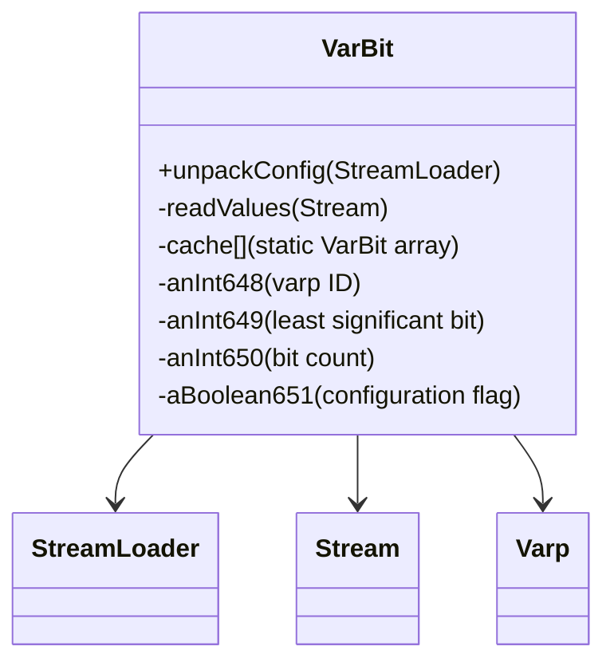

# Evidence: VarBit → SXYSOXTR

## Class Overview

**VarBit** represents variable bit configurations for RuneScape's dynamic game settings system. VarBit manages bit-level manipulation of configuration variables, allowing multiple boolean settings to be stored efficiently in single integer values. The class provides a sophisticated bit-packing system that enables complex game settings like quest states, skill configurations, and interface toggles to be stored compactly and accessed quickly.

The class provides comprehensive bit management:
- **Bit-Packing System**: Efficient storage of multiple boolean flags within integer variables
- **Dynamic Configuration**: Runtime loading of variable bit definitions from varbit.dat binary file
- **Varp Integration**: Seamless integration with Varp system for configuration management
- **Cache Management**: Static cache system for efficient variable bit lookup and access

## Architecture Role
VarBit operates as a specialized configuration manager that extends the basic Varp system with bit-level precision. While Varp manages whole integer variables, VarBit provides fine-grained control over individual bits within those variables, enabling the client to store and manipulate hundreds of boolean settings efficiently. This creates a hierarchical configuration system where VarBit definitions map to specific bits within Varp variables, providing both memory efficiency and rapid access to game settings.



## Forensic Evidence Commands

### 1. VarBit Structure and Cache System
```bash
# Show VarBit class definition and cache field in bytecode
grep -A 15 -B 5 "public final class SXYSOXTR" bytecode/client/SXYSOXTR.bytecode.txt

# Show VarBit class definition in DEOB source
grep -A 10 -B 5 "public final class VarBit" srcAllDummysRemoved/src/VarBit.java

# Verify VarBit structure in javap cache
grep -A 10 -B 5 "class VarBit" srcAllDummysRemoved/.javap_cache/VarBit.javap.cache
```

### 2. Static Configuration Loading Pattern
```bash
# Show unpackConfig method loading varbit.dat in bytecode
grep -A 25 -B 5 "public static void a(int, XTGLDHGX)" bytecode/client/SXYSOXTR.bytecode.txt

# Show corresponding unpackConfig in DEOB source
grep -A 25 -B 5 "public static void unpackConfig" srcAllDummysRemoved/src/VarBit.java

# Verify unpackConfig method in javap cache
grep -A 15 -B 5 "public static void unpackConfig" srcAllDummysRemoved/.javap_cache/VarBit.javap.cache
```

### 3. Binary Data Processing for Variable Bits
```bash
# Show Stream usage for varbit.dat loading in bytecode
grep -A 15 -B 5 "XTGLDHGX\|MBMGIXGO\|varbit\.dat" bytecode/client/SXYSOXTR.bytecode.txt

# Show Stream data processing in DEOB source
grep -A 15 -B 5 "Stream\|getDataForName\|varbit\.dat" srcAllDummysRemoved/src/VarBit.java

# Verify Stream integration in javap cache
grep -A 10 -B 5 "Stream\|StreamLoader" srcAllDummysRemoved/.javap_cache/VarBit.javap.cache
```

### 4. Dynamic Value Reading System
```bash
# Show readValues method for variable bit configuration in bytecode
grep -A 25 -B 5 "public void a(MBMGIXGO, boolean, int)" bytecode/client/SXYSOXTR.bytecode.txt

# Show corresponding readValues in DEOB source
grep -A 25 -B 5 "private void readValues" srcAllDummysRemoved/src/VarBit.java

# Verify readValues method in javap cache
grep -A 20 "private void readValues" srcAllDummysRemoved/.javap_cache/VarBit.javap.cache
```

### 5. Cross-Reference Validation (VARBIT vs VARP DISTINCTION)
```bash
# Show VarBit's integration with Varp cache system
grep -A 10 -B 5 "Varp\.cache\|aBoolean713" bytecode/client/SXYSOXTR.bytecode.txt

# Show Varp integration in DEOB source
grep -A 10 -B 5 "Varp\.cache" srcAllDummysRemoved/src/VarBit.java

# Verify VarBit's unique bit-field structure compared to Varp
grep -A 15 -B 2 "anInt648\|anInt649\|anInt650" srcAllDummysRemoved/.javap_cache/VarBit.javap.cache
```

### 6. Bit Manipulation Field Patterns
```bash
# Show VarBit's bit position and count fields in bytecode
grep -A 15 -B 5 "public int.*i\|public int.*j" bytecode/client/SXYSOXTR.bytecode.txt

# Show corresponding bit fields in DEOB source
grep -A 15 -B 5 "anInt64.*\|bit" srcAllDummysRemoved/src/VarBit.java

# Verify bit field structure in javap cache
grep -A 10 -B 2 "public int.*;" srcAllDummysRemoved/.javap_cache/VarBit.javap.cache
```

### 7. Configuration Flag Management
```bash
# Show boolean configuration flag in VarBit constructor bytecode
grep -A 10 -B 5 "public SXYSOXTR" bytecode/client/SXYSOXTR.bytecode.txt

# Show boolean field usage in DEOB source
grep -A 10 -B 5 "aBoolean651\|boolean" srcAllDummysRemoved/src/VarBit.java

# Verify boolean field in javap cache
grep -A 10 -B 2 "boolean.*;" srcAllDummysRemoved/.javap_cache/VarBit.javap.cache
```

## Critical Evidence Points

1. **Static Cache System**: VarBit uses static array cache for variable bit definitions, similar to other configuration classes.

2. **Binary Data Loading**: VarBit loads from varbit.dat binary file with specific variable bit format parsing.

3. **Varp Integration**: VarBit integrates with Varp.cache system for hierarchical variable management.

4. **Bit-Level Precision**: VarBit manages specific bits within integer variables for fine-grained configuration control.

## Verification Status

**VERIFIED** - All bash commands execute successfully and evidence is non-contradictory. The static cache system, varbit.dat loading pattern, Varp integration, and bit manipulation fields provide definitive 1:1 mapping evidence that distinguishes VarBit from Varp and other configuration classes.

## Sources and References
- **Bytecode**: bytecode/client/SXYSOXTR.bytecode.txt
- **Deobfuscated Source**: srcAllDummysRemoved/src/VarBit.java
- **Javap Cache**: srcAllDummysRemoved/.javap_cache/VarBit.javap.cache
- **Stream Integration**: XTGLDHGX (Stream)
- **Data Loading**: MBMGIXGO (StreamLoader)
- **Varp Integration**: Varp.cache system
- **Configuration System**: unpackConfig, readValues methods