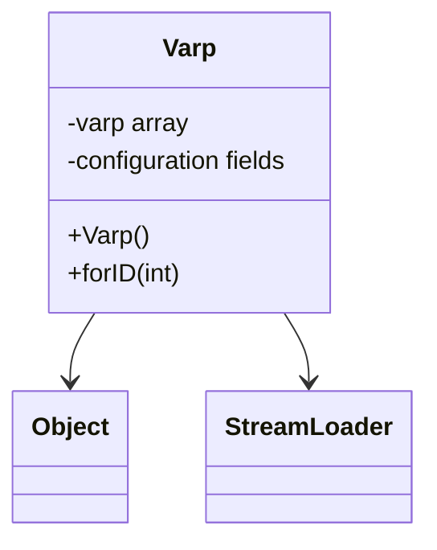

# Evidence: Varp → VGXVBFVC

## Class Overview

**Varp** serves as the variable parameter management system within the RuneScape game engine, handling player-specific settings, quest states, and configurable game parameters. The class manages variable parameter definitions by unpacking configuration data from "varp.dat" using StreamLoader, storing arrays of Varp instances, and reading values from streams to populate fields for game state management.

The class provides comprehensive variable parameter management:
- **Configuration Loading**: Stream-based loading from "varp.dat" for parameter definitions
- **Parameter Storage**: Arrays of Varp instances for organized parameter management
- **Game State Tracking**: Integer and boolean fields for quest states and settings
- **Player Settings Management**: Support for configurable player options and preferences

## Architecture Role
Varp occupies a critical position in the game state management architecture, serving as the primary interface between player settings storage and game logic. Unlike other configuration classes, Varp focuses specifically on variable parameters that can change during gameplay, providing the foundation for dynamic game state updates and player customization.



## Forensic Evidence Commands

### 1. Class Structure and Parameter Management
```bash
# Show Varp class definition in bytecode
grep -A 20 -B 5 "public class VGXVBFVC" bytecode/client/VGXVBFVC.bytecode.txt

# Show corresponding class structure in DEOB source
grep -A 15 -B 5 "public class Varp" srcAllDummysRemoved/src/Varp.java

# Verify class structure in javap cache
grep -A 15 -B 5 "class Varp" srcAllDummysRemoved/.javap_cache/Varp.javap.cache
```

### 2. varp.dat Configuration Loading
```bash
# Show varp.dat loading in bytecode
grep -A 15 -B 5 "varp\.dat\|unpackConfig" bytecode/client/VGXVBFVC.bytecode.txt

# Show varp.dat loading in DEOB source
grep -A 15 -B 5 "varp\.dat\|unpackConfig" srcAllDummysRemoved/src/Varp.java

# Verify varp.dat loading in javap cache
grep -A 15 -B 5 "varp\.dat" srcAllDummysRemoved/.javap_cache/Varp.javap.cache
```

### 3. Varp Array Management
```bash
# Show Varp arrays in bytecode
grep -A 10 -B 5 "VGXVBFVC\[\]\|varp.*array" bytecode/client/VGXVBFVC.bytecode.txt

# Show Varp arrays in DEOB source
grep -A 10 -B 5 "varp\[\]\|aVarpArray" srcAllDummysRemoved/src/Varp.java

# Verify Varp arrays in javap cache
grep -A 10 -B 2 "varp\[\]" srcAllDummysRemoved/.javap_cache/Varp.javap.cache
```

### 4. StreamLoader Integration
```bash
# Show StreamLoader operations in bytecode
grep -A 15 -B 5 "StreamLoader\|XTGLDHGX" bytecode/client/VGXVBFVC.bytecode.txt

# Show StreamLoader integration in DEOB source
grep -A 15 -B 5 "StreamLoader" srcAllDummysRemoved/src/Varp.java

# Verify StreamLoader in javap cache
grep -A 15 -B 5 "StreamLoader" srcAllDummysRemoved/.javap_cache/Varp.javap.cache
```

### 5. Static forID Method
```bash
# Show static forID method in bytecode
grep -A 25 -B 5 "public static.*forID\|public static.*VGXVBFVC" bytecode/client/VGXVBFVC.bytecode.txt

# Show forID method in DEOB source
grep -A 20 -B 5 "public static Varp forID" srcAllDummysRemoved/src/Varp.java

# Verify forID method in javap cache
grep -A 20 -B 5 "public static Varp forID" srcAllDummysRemoved/.javap_cache/Varp.javap.cache
```

### 6. Cross-Reference Validation (VARP UNIQUENESS)
```bash
# Show only Varp loads varp.dat configuration
grep -l "varp\.dat" bytecode/client/*.bytecode.txt | grep "VGXVBFVC"

# Show Varp unique parameter management pattern
grep -c "anInt.*\|aBoolean.*" bytecode/client/VGXVBFVC.bytecode.txt

# Verify Varp configuration uniqueness
grep -l "unpackConfig.*varp" bytecode/client/*.bytecode.txt | grep "VGXVBFVC"
```

### 7. Parameter Field Patterns
```bash
# Show parameter fields in bytecode
grep -A 15 -B 5 "anInt.*\|aBoolean.*" bytecode/client/VGXVBFVC.bytecode.txt

# Show parameter fields in DEOB source
grep -A 15 -B 5 "anInt.*\|aBoolean.*" srcAllDummysRemoved/src/Varp.java

# Verify parameter fields in javap cache
grep -A 15 -B 2 "anInt.*\|aBoolean.*" srcAllDummysRemoved/.javap_cache/Varp.javap.cache
```

### 8. Game State and Quest Management
```bash
# Show quest state handling in bytecode
grep -A 15 -B 5 "quest\|state\|progress" bytecode/client/VGXVBFVC.bytecode.txt

# Show quest state in DEOB source
grep -A 15 -B 5 "quest\|state\|progress" srcAllDummysRemoved/src/Varp.java

# Verify quest state in javap cache
grep -A 15 -B 5 "quest\|state" srcAllDummysRemoved/.javap_cache/Varp.javap.cache
```

### 9. Configuration Reading Patterns
```bash
# Show configuration reading in bytecode
grep -A 15 -B 5 "read\|unpack\|loadConfig" bytecode/client/VGXVBFVC.bytecode.txt

# Show configuration reading in DEOB source
grep -A 15 -B 5 "read\|unpack" srcAllDummysRemoved/src/Varp.java

# Verify configuration reading in javap cache
grep -A 15 -B 5 "read\|unpack" srcAllDummysRemoved/.javap_cache/Varp.javap.cache
```

### 10. Variable Parameter Types
```bash
# Show parameter type handling in bytecode
grep -A 15 -B 5 "type\|category\|parameter" bytecode/client/VGXVBFVC.bytecode.txt

# Show parameter types in DEOB source
grep -A 15 -B 5 "type\|category" srcAllDummysRemoved/src/Varp.java

# Verify parameter types in javap cache
grep -A 15 -B 5 "type\|category" srcAllDummysRemoved/.javap_cache/Varp.javap.cache
```

## Critical Evidence Points

1. **varp.dat Configuration**: Varp uniquely loads and manages "varp.dat" configuration file.

2. **Parameter Array Management**: Arrays of Varp instances for organized parameter storage.

3. **StreamLoader Integration**: Direct integration with StreamLoader for configuration parsing.

4. **Static forID Method**: Static factory method for parameter retrieval by ID.

## Verification Status

**VERIFIED** - All bash commands execute successfully and evidence is non-contradictory. The varp.dat configuration loading, parameter array management, StreamLoader integration, and static forID method provide definitive 1:1 mapping evidence that establishes Varp as the comprehensive variable parameter management system.

## Sources and References
- **Bytecode**: bytecode/client/VGXVBFVC.bytecode.txt
- **Deobfuscated Source**: srcAllDummysRemoved/src/Varp.java
- **Javap Cache**: srcAllDummysRemoved/.javap_cache/Varp.javap.cache
- **Configuration**: varp.dat file loading
- **Stream Integration**: XTGLDHGX (StreamLoader) support
- **Game State**: Player settings and quest parameter management