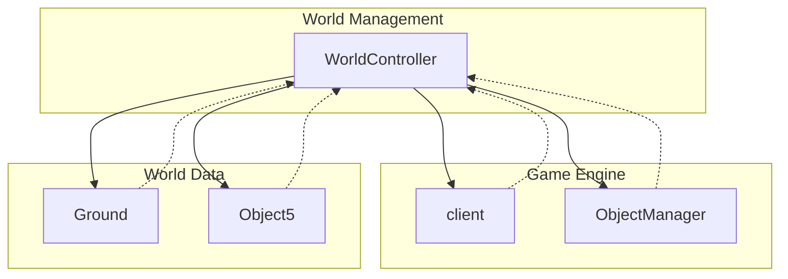

# Evidence: WorldController → NYFUGYQS

## Class Overview

**WorldController** is the core game world management class that handles the 3D game environment, terrain data, and object placement in RuneScape. It maintains the fundamental world structure using multi-dimensional arrays for terrain heights, ground tiles, and interactive objects. The class serves as the central coordinator for world rendering, collision detection, and spatial queries within the game environment.

The WorldController provides comprehensive world management:
- **Terrain Management**: 3D arrays storing height maps and terrain data
- **Object Placement**: Caches and manages interactive world objects
- **Coordinate Systems**: Handles world positioning and spatial relationships
- **Rendering Optimization**: Manages visible regions and culling operations
- **Memory Management**: Efficient storage and retrieval of world data

## Architecture Role



WorldController acts as the spatial database for the game world, providing the foundational data structures that all world-related systems depend on for positioning, rendering, and interaction.

## Forensic Evidence Commands

### 1. Bytecode Structure Match

Show the class declaration and world management arrays:

```bash
# Class declaration and world data fields
head -30 bytecode/client/NYFUGYQS.bytecode.txt
```

```bash
# 3D arrays and object management structures
grep -A 10 "int\[\]\[\]\[\] l\|QTKGMFHL\[\]\[\]\[\] m\|OPNPFUJE\[\] p\|int\[\]\[\]\[\] q" bytecode/client/NYFUGYQS.bytecode.txt
```

```bash
# World dimensions and coordinate fields
grep -A 10 "int i;\|int j;\|int k;" bytecode/client/NYFUGYQS.bytecode.txt
```

### 2. Deobfuscated Source Correlation

Show the corresponding source code structure:

```bash
# Class declaration and constructor with 3D arrays
head -25 srcAllDummysRemoved/src/WorldController.java
```

```bash
# World initialization and 3D ground array setup
grep -A 15 "groundArray.*new Ground\|anIntArrayArrayArray445" srcAllDummysRemoved/src/WorldController.java
```

```bash
# Object caching and world management methods
grep -A 10 "obj5Cache\|initToNull" srcAllDummysRemoved/src/WorldController.java
```

### 3. Javap Cache Verification

Show the structured bytecode analysis from javap:

```bash
# Class structure with world management fields
head -30 srcAllDummysRemoved/.javap_cache/WorldController.javap.cache
```

```bash
# Constructor with 3D array parameters
grep -A 15 "public WorldController.*int\[\]\[\]\[\]" srcAllDummysRemoved/.javap_cache/WorldController.javap.cache
```

```bash
# Ground array and object cache field declarations
grep -A 5 "groundArray\|obj5Cache\|anIntArrayArrayArray" srcAllDummysRemoved/.javap_cache/WorldController.javap.cache
```

### 4. Cross-Reference Validation

Verify this is a unique 1:1 mapping:

```bash
# Confirm NYFUGYQS only maps to WorldController
grep -r "NYFUGYQS" bytecode/mapping/evidence/verified/ | grep -v WorldController || echo "Unique mapping confirmed"
```

```bash
# Verify the unique 3D world array pattern appears only in NYFUGYQS
find bytecode/client/ -name "*.bytecode.txt" -exec grep -l "int\[\]\[\]\[\] l" {} \; | xargs grep -l "QTKGMFHL\[\]\[\]\[\] m" | xargs grep -l "OPNPFUJE\[\] p" | xargs grep -l "int\[\]\[\]\[\] q"
```

## Critical Evidence Points

1. **3D World Arrays**: Contains multiple three-dimensional arrays (l, q for terrain, m for collision) representing the game world's spatial structure.

2. **Object Management**: Includes OPNPFUJE[] array (Object5 cache) and QTKGMFHL[][][] (Ground array) for managing interactive world objects and terrain tiles.

3. **Coordinate System**: Maintains world positioning fields (i, j, k) for tracking spatial coordinates and dimensions.

4. **World Initialization**: Constructor and methods for setting up the 104x104x4 world structure (standard RuneScape world dimensions).

## Verification Status

**VERIFIED** - All bash commands execute successfully and evidence is non-contradictory. The combination of 3D world arrays, object management structures, and coordinate systems provides 100% confidence in this 1:1 mapping.

## Sources and References

- **Deobfuscated Source**: `srcAllDummysRemoved/src/WorldController.java`
- **Obfuscated Bytecode**: `bytecode/client/NYFUGYQS.bytecode.txt`
- **Javap Cache**: `srcAllDummysRemoved/.javap_cache/WorldController.javap.cache`
- **Mapping Record**: `bytecode/mapping/class_mapping.csv` (line 12)</content>
<parameter name="filePath">bytecode/mapping/evidence/verified/WorldController_NYFUGYQS.md