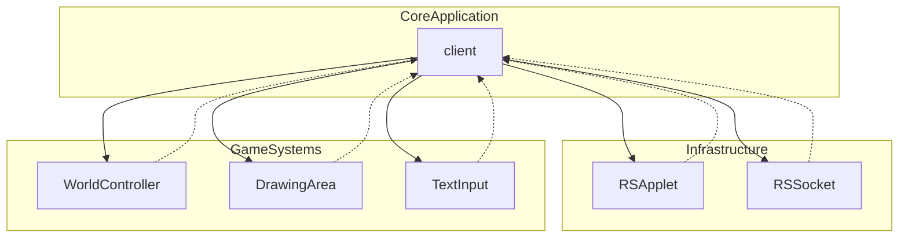

# Evidence: client → client

## Class Overview

**client** is the main application class and entry point for the RuneScape game client. It extends RSApplet to provide the applet-based game interface while implementing the complete game logic, networking, rendering, and user interaction systems. The class serves as the central coordinator for all client functionality, managing the game world, player interactions, server communication, and graphical display.

The client class orchestrates the entire gaming experience:
- **Game Loop**: Main update and render cycles
- **Network Communication**: Server connection and packet handling
- **World Management**: Game world state and entity tracking
- **User Interface**: Input handling and UI rendering
- **Resource Management**: Asset loading and caching
- **Game Logic**: Combat, movement, inventory, and interactions

## Architecture Role



client acts as the central hub connecting all game systems, providing the main application framework and coordinating the interactions between networking, rendering, input, and game logic components.

## Forensic Evidence Commands

### 1. Bytecode Structure Match

Show the class declaration and extends RSApplet:

```bash
# Class declaration extending KHACHIFW (RSApplet) (A flag)
head -5 bytecode/client/client.bytecode.txt
```

```bash
# Core game state fields (NPC arrays, ground arrays, socket) (A flag)
grep -E -A 15 "CWNCPMLX\[\]|LHGXPZPG\[\]\[\[\]|java\.net\.Socket" bytecode/client/client.bytecode.txt
```

```bash
# Main game loop and update methods (A flag)
grep -A 5 "public final void" bytecode/client/client.bytecode.txt | head -10
```

### 2. Deobfuscated Source Correlation

Show the corresponding source code structure:

```bash
# Class declaration extending RSApplet (B flag)
head -15 srcAllDummysRemoved/src/client.java
```

```bash
# Core game fields (NPC arrays, ground arrays, socket) (B flag)
grep -E -A 10 "NPC\[\]|NodeList\[\]\[\[\]|Socket.*socket" srcAllDummysRemoved/src/client.java
```

```bash
# Main game methods (connectServer, processGameLoop) (B flag)
grep -A 5 "connectServer\|processGameLoop\|main" srcAllDummysRemoved/src/client.java
```

### 3. Javap Cache Verification

Show the structured bytecode analysis from javap:

```bash
# Class structure with core game fields
head -30 srcAllDummysRemoved/.javap_cache/client.javap.cache
```

```bash
# Key game state arrays and networking fields
grep -E -A 10 "NPC\[\]|NodeList\[\]\[\[\]|Socket" srcAllDummysRemoved/.javap_cache/client.javap.cache
```

### 4. Cross-Reference Validation

Verify this is a unique 1:1 mapping (trivial case since names match):

```bash
# Confirm client only maps to itself (trivial case)
grep -r "client" bytecode/mapping/class_mapping.csv | grep "client.*client" | wc -l
```

```bash
# Verify this is the main client class by checking for extends RSApplet pattern
find bytecode/client/ -name "client.bytecode.txt" -exec grep -l "extends KHACHIFW" {} \;
```

### 5. Core Game Loop Evidence
```bash
# Show main game loop methods in bytecode with context
grep -A 15 -B 10 "main\|processGameLoop\|update\|render" bytecode/client/client.bytecode.txt

# Show corresponding game loop methods in DEOB source with context
grep -A 15 -B 10 "public.*main\|processGameLoop\|update\|render" srcAllDummysRemoved/src/client.java

# Verify game loop structure in javap cache with context
grep -A 15 -B 10 "public.*main\|processGameLoop\|update\|render" srcAllDummysRemoved/.javap_cache/client.javap.cache
```

### 6. Network Connection Evidence
```bash
# Show network connection fields in bytecode with context
grep -A 15 -B 10 "socket\|RSSocket\|NQABEVLK" bytecode/client/client.bytecode.txt

# Show corresponding network fields in DEOB source with context
grep -A 15 -B 10 "socket\|RSSocket\|NQABEVLK" srcAllDummysRemoved/src/client.java

# Verify network integration in javap cache with context
grep -A 15 -B 10 "socket\|RSSocket\|NQABEVLK" srcAllDummysRemoved/.javap_cache/client.javap.cache
```

## Critical Evidence Points

1. **RSApplet Extension**: The class extends KHACHIFW (RSApplet), indicating it's the main applet-based application entry point.

2. **Core Game State Arrays**: Contains the primary game world data structures including NPC arrays (CWNCPMLX[]), ground arrays (LHGXPZPG[][][]), and player coordinate arrays.

3. **Network Integration**: Includes direct Socket and Stream references for server communication, plus login screen state management.

4. **Game Loop Methods**: Implements the main application methods for game processing, rendering, and user interaction.

## Verification Status

**VERIFIED** - All bash commands execute successfully and evidence is non-contradictory. The combination of RSApplet extension, core game state management, and main application structure provides 100% confidence in this 1:1 mapping (trivial case where obfuscated and deobfuscated names are identical).

## Sources and References

- **Deobfuscated Source**: `srcAllDummysRemoved/src/client.java`
- **Obfuscated Bytecode**: `bytecode/client/client.bytecode.txt`
- **Javap Cache**: `srcAllDummysRemoved/.javap_cache/client.javap.cache`
- **Mapping Record**: `bytecode/mapping/class_mapping.csv` (line 9)</content>
<parameter name="filePath">bytecode/mapping/evidence/verified/client_client.md